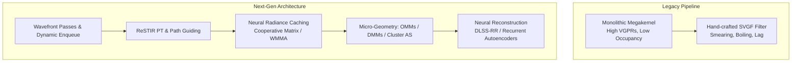
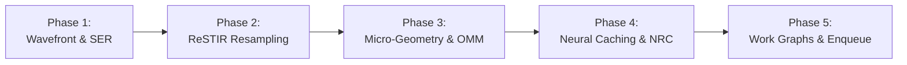

# Next-Generation Path Tracing & Vulkan API Evolution: Technical Architecture & Future Roadmap

## 1. Executive Summary & Architectural Vision

Real-time path tracing is transitioning from brute-force Monte Carlo estimation with aggressive heuristic spatial-temporal filtering toward an integrated paradigm: **physically guided, resampled, neural-accelerated, and micro-geometric wavefront path tracing**.

In traditional real-time path tracing pipelines (1–2 samples per pixel), renderers trace 2 to 4 bounces through a monolithic megakernel and rely on spatiotemporal variance-guided filtering (e.g., SVGF, A-SVGF) to reconstruct images. This legacy approach suffers from three fundamental bottlenecks:
1. **Severe Undersampling & Energy Loss:** At 1 spp, high-dimensional light paths (indirect glossy bounces, caustics, participating media) fail to resolve; heuristic filters blur out high-frequency geometry, smear contact shadows, and exhibit lag/boiling during dynamic lighting or camera motion.
2. **GPU Hardware Inefficiency:** Monolithic megakernels incur massive register pressure (128–256+ VGPRs per thread), dropping SIMD occupancy to 12.5%–25% on modern GPU architectures (such as AMD RDNA 4 and NVIDIA Blackwell/Ada Lovelace). Branch divergence and memory divergence across disparate materials throttle hardware utilization.
3. **Geometric Detail Limits:** Complex micro-geometry (dense foliage, hair, displaced terrain, virtualized geometry) causes ray traversal stalls due to Any-Hit Shader (AHS) invocations and unmanageably large Bottom-Level Acceleration Structure (BLAS) memory footprints.



To maintain a strict 60–120 FPS real-time frametime budget (8.33 ms – 16.6 ms total frame time, with **4.0 ms – 7.5 ms dedicated to the path tracing core**), rendering engines must exploit algorithmic variance reduction alongside hardware-level Vulkan features. This document outlines the key techniques, mathematical frameworks, and Vulkan API specifications that enable orders-of-magnitude increases in visual fidelity at identical or reduced frametimes.

---

## 2. ReSTIR Scaling: Path Resampling & Participating Media

### 2.1 Theoretical Framework: Generalized Resampled Importance Sampling (GRIS)
Traditional ReSTIR (Bitterli et al., 2020) focused on direct illumination (ReSTIR DI) by sampling 1D/2D indices of emissive triangles. Extending reservoir resampling to multi-bounce indirect paths (ReSTIR PT, Lin et al., 2022/2023) and volumetric media (vReSTIR) requires formulating path reuse under the **Generalized Resampled Importance Sampling (GRIS)** framework.

In GRIS, an unbiased Monte Carlo estimator for pixel $q$ with measurement contribution function $f(x)$ is constructed by resampling $M$ candidate paths generated from proposal distributions across spatial and temporal domains. Each pixel maintains a reservoir $R = \{ \bar{x}, \hat{p}(\bar{x}), w_{\text{sum}}, M, W \}$ containing:
- $\bar{x} = (x_0, x_1, \dots, x_k)$: A multi-segment path sequence.
- $\hat{p}(\bar{x})$: The target scalar contribution (typically unshadowed or shadowed path contribution to the pixel).
- $w_{\text{sum}} = \sum_{i=1}^M w_i$: The accumulated weight of all stream candidates.
- $M$: Total count of candidate samples considered.
- $W = \frac{1}{\hat{p}(\bar{x})} \left( \frac{w_{\text{sum}}}{M} \right)$: The unbiased reservoir evaluation weight.

When combining a reservoir from pixel $q$ with candidate paths $\bar{y}$ drawn from a neighboring pixel $r$, the target function changes from $\hat{p}_r(\bar{y})$ to $\hat{p}_q(T_{r \to q}(\bar{y}))$, where $T_{r \to q}$ is a **shift mapping**.

```
Temporal Resampling (Frame t-1)        Spatial Resampling (Neighbors)
           │                                         │
           ▼                                         ▼
   ┌───────────────┐                         ┌───────────────┐
   │ Temporal Shift│                         │ Spatial Shift │
   │    Mapping    │                         │    Mapping    │
   └───────┬───────┘                         └───────┬───────┘
           │                                         │
           └───────────────────┬─────────────────────┘
                               │
                               ▼
                   ┌───────────────────────┐
                   │  Pairwise MIS (P-MIS) │
                   │  Weight Canonicalizer │
                   └───────────┬───────────┘
                               │
                               ▼
                   ┌───────────────────────┐
                   │  Final Path Reservoir │
                   │  w/ Occlusion Testing │
                   └───────────────────────┘
```

### 2.2 Shift Mappings and Jacobian Determinants
Because paths are continuous geometric chains embedded in high-dimensional path space, transferring path $\bar{y}$ from pixel $r$ to pixel $q$ alters the integration measure. The estimator requires evaluating the **Jacobian determinant** of the shift mapping:

$$
w_{r \to q} = \frac{\hat{p}_q(T_{r \to q}(\bar{y}))}{\hat{p}_r(\bar{y})} \cdot \left| \det \mathbf{J}_{T_{r \to q}}(\bar{y}) \right|
$$

Modern ReSTIR PT implementations use three primary shift mappings depending on surface roughness and path configuration:

```
                  ┌────────────────────────────────────────────────────────┐
                  │                 Select Shift Mapping                   │
                  └───────────────────────────┬────────────────────────────┘
                                              │
                    ┌─────────────────────────┼────────────────────────┐
                    │                         │                        │
                    ▼                         ▼                        ▼
       [Rough / Diffuse Hit]      [Specular / Caustic]     [Complex Micro-geometry]
       ┌─────────────────────┐    ┌─────────────────────┐  ┌─────────────────────┐
       │ Hybrid Reconnection │    │ Manifold Exploration│  │Random Number Replay │
       │ (Vertex k Connect)  │    │ (Newton-Raphson)    │  │ (RNR Invertible)    │
       └─────────────────────┘    └─────────────────────┘  └─────────────────────┘
```

1. **Hybrid Reconnection Shift:**
   - Connects the primary hit vertex $x_1$ of pixel $q$ directly to vertex $y_k$ of neighbor path $\bar{y}$.
   - The Jacobian accounts for the change in the geometric coupling term $G(x_1, y_k)$:
     $$
     \left| \det \mathbf{J}_{\text{recon}} \right| = \frac{G(x_1, y_k)}{G(y_1, y_k)} = \frac{\cos\theta_{x_1} \cos\theta_{y_k \to x_1} \, \|y_1 - y_k\|^2}{\cos\theta_{y_1} \cos\theta_{y_k \to y_1} \, \|x_1 - y_k\|^2}
     $$
   - Requires an explicit visibility test between $x_1$ and $y_k$.

2. **Random-Number Replay (RNR):**
   - Replays the exact pseudorandom numbers $u \in [0, 1)^d$ used to generate path $\bar{y}$ starting from $x_1$.
   - The Jacobian is formulated through differential path perturbation:
     $$
     \left| \det \mathbf{J}_{\text{RNR}} \right| = \prod_{i=1}^{k-1} \frac{\cos\theta_{x_i}}{\cos\theta_{y_i}} \frac{\|y_i - y_{i+1}\|^2}{\|x_i - x_{i+1}\|^2}
     $$
   - Effective when geometry is smooth and materials are rough; can suffer from path bifurcation across geometric silhouettes.

3. **Specular Manifold Exploration Shift:**
   - For specular-diffuse-specular (caustic) chains, small surface perturbations break the half-vector constraint:
     $$
     H(x_i; x_{i-1}, x_{i+1}) = \frac{x_{i-1} - x_i}{\|x_{i-1} - x_i\|} + \frac{x_{i+1} - x_i}{\|x_{i+1} - x_i\|} \parallel n(x_i)
     $$
   - Solves for the shifted path using Newton-Raphson iterations on the specular manifold, computing the exact manifold derivative matrix:
     $$
     \mathbf{J}_{\text{manifold}} = \left( \frac{\partial H}{\partial x_i} \right)^{-1} \left( \frac{\partial H}{\partial x_{i-1}} \right)
     $$
   - Eliminates boiling and temporal flickering in caustics.

### 2.3 Artifact Mitigation: Boiling and Correlation Bias
Spatial and temporal resampling can lead to energy explosion (fireflies) and spatial correlation clumping (boiling) when $w_{r \to q}$ spikes due to near-singular Jacobians or visibility mismatches. Two mechanisms solve this:

- **Pairwise Multiple Importance Sampling (P-MIS):**
  Instead of evaluating full multi-sample MIS across all candidates (which requires $\mathcal{O}(M^2)$ visibility queries), P-MIS pairs the selected candidate against the target pixel’s canonical distribution, proving unbiased convergence with only $\mathcal{O}(1)$ shadow rays per pixel.
- **Defensive Sampling & History Clamping:**
  Bounding temporal history ($M_{\text{temporal}} \le 20\text{--}30$) and mixing a defensive candidate path (10%–20% weight allocated to an independent primary path) guarantees non-zero target probability density, avoiding infinite variance.

### 2.4 vReSTIR: Volumetric Participating Media
Extending ReSTIR to heterogeneous volumes (clouds, smoke, atmospheric fog, subsurface scattering) requires resampling inside continuous 3D media:

- **Joint Phase-Transmittance Sampling:**
  Paths sample scattering vertices $x_s$ along a ray segment $[x_0, x_1]$ according to majorant extinction $\bar{\mu}_t$ using ratio tracking or null-collision algorithms.
- **Volumetric Reservoir Payload:**
  Stores the scattering vertex $x_s$, incoming direction $\omega_i$, local scattering albedo $\mu_s(x_s)$, and Henyey-Greenstein phase function parameter $g$.
- **Reconnection Transmittance:**
  When reconnecting a volumetric reservoir to another pixel, transmittance $\tau(x_s, y_1) = \exp(-\int \mu_t(t) dt)$ is evaluated via stochastic shadow rays (residual tracking).

### 2.5 Performance & Visual Impact
- **Fidelity Gain:** Resolves complex multi-bounce indirect lighting, colour bleeding, and specular caustics at **1 spp** that would otherwise require 512–2048 spp in standard path tracing.
- **Performance Cost:** Adds ~1.5 ms – 2.8 ms per frame at 1440p on AMD RDNA 4 / modern architectures for reservoir storage, shift evaluations, and visibility reconnection checks.
- **Net Trade-off:** Replaces brute-force spatial denoising, resulting in higher sharpness and temporal stability under dynamic lighting transitions without ghosting.

---

## 3. Neural Radiance Caching (NRC) & Neural Reconstruction

### 3.1 Neural Radiance Caching Architecture
Real-time path tracers often spend 70%+ of their frame time evaluating bounces 3 through 8. While bounces 1 and 2 define sharp geometric silhouettes, contact shadows, and mirror reflections, subsequent bounces represent low-frequency diffuse and glossy equilibrium radiance.

```
Camera Ray
    │
    ▼ [Bounce 0: Primary Surface Hit]
    │  - Physical G-Buffer evaluation (Normals, Depth, Albedo, Roughness)
    │
    ▼ [Bounce 1: Secondary Path Tracing]
    │  - Physical Ray Traced Reflection / Refraction
    │
    ▼ [Bounce 2+: Path Termination & Caching]
    ├─────────────────────────────────────────────────────────────────┐
    │                                                                 │
    ▼                                                                 ▼
[Inference Path (~95% of Rays)]                    [Training Path (~5% of Rays)]
Query Online MLP via Multiresolution Hash Grid     Trace physical bounces 3..6
Output: Inferred Radiance L_cache                  Compute Monte Carlo Target L_target
                                                   Compute Loss & Backprop Online
```

**Neural Radiance Caching (NRC)** replaces deep physical bounce chains with an online-trained, real-time neural network:
- **Primary and Secondary Bounces (Bounces 0–1):** Evaluated via hardware ray tracing to preserve contact details and high-frequency specular BRDF responses.
- **Terminal Bounce Caching (Bounce 2+):** Rays terminate and query a lightweight neural network:
  $$
  L_{\text{cache}} \approx f_\theta(x, \omega_o, \vec{n}, \text{roughness}, \text{albedo})
  $$
- **Multiresolution Hash Encoding:**
  Inputs $x \in \mathbb{R}^3$ are encoded using an Instant-NGP style spatial hash table with $L=12\text{--}16$ resolution levels. Each level stores $T=2^{14}\text{--}2^{18}$ $F$-dimensional feature vectors (typically $F=2$), linearly interpolated. Direction $\omega_o$ is encoded via spherical harmonics (degree 4).
- **Network Topology:**
  A 2-to-3 layer Multi-Layer Perceptron (MLP) with 64 hidden units per layer, utilizing activation functions such as Leaky ReLU or Half-Precision GELU.

### 3.2 Online Self-Supervised Training Pipeline
Unlike offline-trained denoisers, NRC adapts to dynamic geometry, destructible environments, dynamic time of day, and moving light sources in real time without pre-training:

1. **Training Sample Stratification:**
   A small fraction of screen pixels (~1% to 5%) or stochastic path branches are selected as training rays.
2. **Path Bootstrapping:**
   Training rays trace an additional 2 to 4 physical bounces past the cache query point to generate a ground-truth radiance target $L_{\text{target}}$.
3. **Loss Function:**
   Trained via a relative $\ell_1$ or symmetric log-cosh loss function to prevent fireflies from skewing gradient steps:
   $$
   \mathcal{L}(L_{\text{cache}}, L_{\text{target}}) = \frac{|L_{\text{cache}} - L_{\text{target}}|}{\text{stop\_gradient}(L_{\text{cache}}) + \epsilon}
   $$
4. **Per-Frame Gradient Step:**
   Gradients are computed on the GPU and backpropagated into network weights $\theta$ every frame via Adam or stochastic gradient descent with momentum.

### 3.3 Neural Reconstruction Networks (Beyond SVGF)
Traditional spatiotemporal denoisers (SVGF, A-SVGF) use hand-crafted bilateral filter kernels that depend on surface normal, depth, and luminance differences. These filters break down on glossy surfaces where reflection motion does not match surface geometric motion, causing blurriness and smearing.

**Neural Reconstruction (e.g., DLSS Ray Reconstruction / Modern Recurrent Autoencoders)** treats denoising, super-resolution, and radiometric separation as an end-to-end task:
- **Input Channels:** Disentangled diffuse radiance, specular radiance, 2.5D specular hit distance, linear depth, surface normals, roughness, and motion vectors (surface + specular reflection motion vectors).
- **Recurrent Spatiotemporal Convolutions:** A lightweight U-Net or temporal autoencoder with recurrent skip connections tracks radiance history across frames.
- **Feature Disentanglement:** Isolates specular flows (which move according to the virtual reflected hit position) from diffuse flows (which track geometric surface motion).
- **High-Frequency Preservation:** Preserves sharp shadow borders, anisotropic specular highlights, and thin alpha geometry at 1 spp without temporal smearing.

### 3.4 Vulkan API Mapping: Cooperative Matrix & Vector Extensions
Running an online MLP within a 60 FPS graphics queue requires low-latency GPU tensor execution:

- **`VK_KHR_cooperative_matrix`:**
  Exposes hardware matrix-multiply-accumulate (MMA) capabilities to compute shaders. SPIR-V shaders load 2D sub-matrices into cooperative matrix registers:
  ```glsl
  #extension GL_KHR_cooperative_matrix : enable
  coopmat<float16_t, gl_ScopeSubgroup, 16, 16, gl_MatrixUseA> matA;
  coopmat<float16_t, gl_ScopeSubgroup, 16, 16, gl_MatrixUseB> matB;
  coopmat<float32_t, gl_ScopeSubgroup, 16, 16, gl_MatrixUseAccumulator> matC;
  matC = coopMatMulAddNV(matA, matB, matC); // or KHR equivalent
  ```
- **`VK_NV_cooperative_matrix2` & `VK_NV_cooperative_vector`:**
  Introduces optimized memory layouts tailored for both stages of NRC:
  - `VK_COOPERATIVE_VECTOR_MATRIX_LAYOUT_INFERENCING_OPTIMAL_NV`: Maximizes weight cache hits during the high-throughput 95% inference pass.
  - `VK_COOPERATIVE_VECTOR_MATRIX_LAYOUT_TRAINING_OPTIMAL_NV`: Optimizes transposed reads and write-backs for backward gradient passes.
- **Hardware Mapping on AMD RDNA 4 (gfx1201):**
  Maps directly to Wave32/Wave64 WMMA (Wave Matrix Multiply Accumulate) instructions, allowing FP16/BF16 matrix multiplication alongside path tracing compute dispatches.

---

## 4. Wavefront Architecture vs. Megakernels

### 4.1 The Megakernel Bottleneck
A monolithic path tracer executes as a single ray generation shader (`raytrace.rgen` or a monolithic compute kernel):

```glsl
// Monolithic Megakernel Pattern (Suffers from Divergence and Register Spills)
void main() {
    Ray ray = GenerateCameraRay();
    vec3 throughput = vec3(1.0);
    for (int bounce = 0; bounce < MAX_BOUNCES; ++bounce) {
        HitRecord hit = TraceRay(ray);
        if (hit.miss) break;
        Material mat = LoadMaterial(hit);
        throughput *= EvaluateBRDF(mat, ray, hit);
        ray = SampleNextRay(mat, hit);
    }
}
```

#### Key Megakernel Inefficiencies:
1. **Extreme Register Pressure (VGPRs):**
   The shader must keep state for all possible material evaluations, random number generators, reservoir structs, camera projections, and hit parameters live simultaneously across ray tracing calls. This consumes **128 to 256+ Vector General-Purpose Registers (VGPRs)** per thread.
   - On modern AMD RDNA architectures (which allocate 1024 VGPRs per SIMD), a 256-register shader drops wave occupancy to **1 wavefront per SIMD (12.5%–25% occupancy)**. Memory latency from texture and BVH reads cannot be hidden.
2. **Severe Thread Divergence:**
   Within a 32-lane or 64-lane wavefront:
   - Thread 0 hits a complex transmissive glass material (Fresnel refraction, dispersion).
   - Thread 1 hits a metallic rough surface (GGX importance sampling).
   - Thread 2 hits an alpha-tested foliage leaf (texture fetch + branch).
   - Thread 3 misses to the environment skybox.
   Because SIMT execution requires lock-step execution, all lanes remain active for all branches, idling execution units and dropping ALU efficiency below 20%.
3. **BVH Cache Thrashing:**
   Secondary rays scatter in arbitrary directions across the scene, causing non-coherent memory fetches across disparate regions of the acceleration structure.

### 4.2 Wavefront Compute Decomposition
The wavefront architecture decomposes the monolithic loop into discrete, specialized compute passes connected by compacted GPU memory ring buffers:

```
┌────────────────────────────────────────────────────────┐
│             Pass 1: Primary Ray Generation             │
│        (Camera model, lens sampling, jittering)        │
└───────────────────────────┬────────────────────────────┘
                            │ Ray Buffer (Compact)
                            ▼
┌────────────────────────────────────────────────────────┐
│             Pass 2: Bulk BVH Traversal                 │
│      (Ray Query compute / Hardware Traversal)          │
└───────────────────────────┬────────────────────────────┘
                            │ Hit Buffer
                            ▼
┌────────────────────────────────────────────────────────┐
│             Pass 3: Stream Compaction & Sorting        │
│  (Subgroup ballots; Sort by Material ID & Morton cell) │
└───────────────────────────┬────────────────────────────┘
                            │ Sorted Work Batches
                            ▼
┌────────────────────────────────────────────────────────┐
│             Pass 4: Material Shading Passes            │
│  - Pipeline A: Opaque PBR (< 32 VGPRs, 100% Occupancy) │
│  - Pipeline B: Dielectric / Transmission               │
│  - Pipeline C: Subsurface / Volume Scattering          │
└───────────────────────────┬────────────────────────────┘
                            │ Next-Ray Buffer + Shadow-Ray Buffer
                            ▼
┌────────────────────────────────────────────────────────┐
│             Pass 5: Binary Shadow Occlusion            │
│        (Ray Query; Terminate on first hit)             │
└───────────────────────────┬────────────────────────────┘
                            │
                            ▼
┌────────────────────────────────────────────────────────┐
│             Pass 6: Accumulation & Filtering           │
└────────────────────────────────────────────────────────┘
```

#### Advantages of Wavefront Decomposition:
- **Low Register Pressure:** Each shader only implements one material type or traversal step. Register usage drops to **32–48 VGPRs**, enabling **maximum (100%) GPU SIMD occupancy**.
- **Coherent Execution:** Threads in a wavefront execute identical material code without branch masking.
- **Stream Compaction:** Terminated rays (sky misses, Russian roulette deaths) are stripped from the stream using subgroup operations (`subgroupBallot`, `subgroupInclusiveAdd`), freeing execution slots for active work.

### 4.3 Vulkan Enabling Extensions for Wavefront Pipelines

#### 1. `VK_EXT_ray_tracing_invocation_reorder` (Shader Execution Reordering / SER)
Allows monolithic or multi-stage ray tracers to dynamically reorder divergent threads directly on hardware without a full software stream-compaction round-trip:
- Hardware/driver bins threads by spatial proximity or material classification before dispatching hit shaders.
- In GLSL / SPIR-V:
  ```glsl
  #extension GL_EXT_ray_tracing_invocation_reorder : enable
  hitObjectEXT hit;
  hitObjectRecordHitEXT(hit, topLevelAS, rayFlags, cullMask, sbtRecordOffset, sbtRecordStride, missIndex, origin, tMin, direction, tMax, payload);
  // Reorder invocations based on material ID and spatial hash
  reorderThreadWithHitObjectEXT(hit);
  hitObjectExecuteShaderEXT(hit, payload);
  ```
- Recovers up to **30%–60% of divergent execution throughput** inside ray generation pipelines.

#### 2. `VK_AMDX_shader_enqueue` (Work Graphs / Execution Graph Pipelines)
Wavefront architectures traditionally require host-recorded indirect dispatches (`vkCmdDispatchIndirect`) and synchronization barriers between each bounce pass. `VK_AMDX_shader_enqueue` brings **Work Graphs** to Vulkan:
- Compute shaders can dynamically spawn child compute tasks directly on the GPU timeline without CPU intervention.
- Shaders declare output nodes and enqueue payloads directly to downstream material or traversal nodes:
  ```glsl
  #extension GL_AMDX_shader_enqueue : enable
  layout(nodeExecutionGraphAMDX) in;
  layout(nodeOutputAMDX, nodeName = "ShadePBR") out nodePayloadARM payloadOut;
  
  void main() {
      // BVH traversal completed; enqueue directly to material node
      enqueueNodeAMDX("ShadePBR", payloadOut);
  }
  ```
- Completely removes CPU dispatch bubbles, memory ping-ponging, and fixed-size allocation bottlenecks.

#### 3. `VK_KHR_ray_tracing_position_fetch`
- In standard Vulkan ray tracing, hit shaders must look up index buffers, vertex buffers, and model matrices to calculate world-space triangle positions, inflating register count.
- `VK_KHR_ray_tracing_position_fetch` allows ray tracing pipelines and ray queries to query world-space and object-space vertex positions directly from the acceleration structure leaf node:
  ```glsl
  #extension GL_KHR_ray_tracing_position_fetch : enable
  vec3 v0, v1, v2;
  rayQueryGetIntersectionTriangleVertexPositionsKHR(rq, true, v0, v1, v2);
  ```
- Eliminates vertex buffer descriptor bindings and memory bandwidth overhead in shading passes.

---

## 5. Real-Time Path Guiding

### 5.1 Sampling Limitations in Unidirectional Path Tracing
Unidirectional path tracers rely heavily on surface BRDF importance sampling:
$$
\omega_i \sim p_{\text{BRDF}}(\omega_i) \propto f_r(x, \omega_i, \omega_o) \, (\omega_i \cdot \vec{n})
$$
While efficient for direct illumination from large unoccluded sources, BRDF sampling fails in indirectly lit scenes:
- Interior rooms lit by sunlight entering through a distant door or window portal.
- Light reflecting off bright floors onto ceilings (indirect diffuse bounces).
- Specular-diffuse-specular (caustic) indirect transport.

In these cases, 90%+ of sampled rays hit dark, occluded surfaces, generating zero radiance contribution and resulting in high sample variance.

```
       [Light Source]
             │
             ▼
        [Window Portal]
             │
             │   (90% of BRDF-sampled rays miss this opening)
             ▼
      ┌─────────────┐
      │  Interior   │ <── Path Guiding learns to sample
      │   Surface   │     preferentially toward the window
      └─────────────┘
```

### 5.2 Real-Time Online Learning of Incident Radiance
Real-time path guiding adapts offline methods (Practical Path Guiding, Müller et al.) to live frame budgets by training an online spatial representation of incoming radiance $L_i(x, \omega)$:

1. **Spatial Representation:**
   The 3D scene bounding box is divided into adaptive spatial cells using:
   - **Spatial Hash Grids:** Fast $\mathcal{O}(1)$ query without hierarchical traversal; spatial cells are hashed using Morton-encoded coordinates.
   - **Directional Quadtrees (D-Trees) / Cylindrical Projections:** Each cell maintains a directional quadtree over the sphere $S^2$, subdividing regions of high incoming flux.
   - **Voxelized Gaussian Mixture Models (V-GMM):** Each cell maintains $K=4\text{--}8$ Spherical Gaussians:
     $$
     G_k(\omega) = \mu_k \exp\left( \frac{\xi_k \cdot \omega - 1}{\lambda_k} \right)
     $$
2. **Decoupled Sample Recording:**
   When secondary rays find paths to light sources, outgoing radiance $L_o(y, -\omega)$ is injected into the spatial cell corresponding to origin $x$.
3. **Temporal Moving Average:**
   Distributions update over frames using an Exponential Moving Average (EMA) with adaptive learning rates ($\alpha \approx 0.02\text{--}0.05$). Under dynamic lighting or camera cuts, statistical divergence tests trigger local cell resets.

### 5.3 Product Importance Sampling
When secondary rays are spawned at surface $x$, the path tracer constructs an approximate product distribution combining the surface BRDF and the learned incoming radiance:
$$
p_{\text{guided}}(\omega) \approx \frac{f_r(x, \omega, \omega_o) \, L_i(x, \omega) \, (\omega \cdot \vec{n})}{\int_{S^2} f_r \cdot L_i \cdot (\omega \cdot \vec{n}) \, d\omega}
$$

In real-time implementations, this is realized via **One-Sample Multiple Importance Sampling (MIS)**:
- Generate candidate $\omega_1 \sim p_{\text{BRDF}}$ and candidate $\omega_2 \sim p_{\text{guide}}$.
- Sample one with probability $\beta \in [0.3, 0.7]$ and evaluate the balanced heuristic:
  $$
  w_{\text{MIS}} = \frac{p(\omega)}{\beta \, p_{\text{guide}}(\omega) + (1-\beta) \, p_{\text{BRDF}}(\omega)}
  $$

### 5.4 Performance & Variance Reduction
- **Quality:** Reduces variance in complex indirect lighting scenarios by **4x to 16x**, effectively converting unusable 1-spp noise into a stable, denoisable signal.
- **Overhead:** ~0.8 ms – 1.6 ms per frame for spatial grid updates and directional sampling queries.

---

## 6. Sub-Triangle Micro-Geometry & Micromaps

### 6.1 The Micro-Polygon Challenge in Ray Tracing
While real-time rasterization has embraced cluster-based virtualized geometry (e.g., Unreal Engine's Nanite, processing 64–128 triangle meshlets with GPU-driven culling and dynamic continuous LOD), ray tracing pipelines have faced two significant bottlenecks:
1. **BLAS Memory & Build Exhaustion:**
   Instantiating millions of micro-triangles in standard hardware BVHs exhausts VRAM (tens of bytes per triangle) and causes prohibitive acceleration structure build times.
2. **Any-Hit Shader (AHS) Traversal Stalls:**
   Alpha-tested surfaces (foliage, hair cards, wire fences) require invoking an Any-Hit Shader for every candidate intersection to sample opacity textures. This stalls hardware traversal units, causes register spills, and reduces ray tracing throughput by **3x to 10x**.

```
Standard Alpha-Test Traversal (AHS Stall)
Ray ──> [BVH Node] ──> [Leaf Triangle] ──> STALL ──> [Invoke Any-Hit Shader] ──> [Sample Texture] ──> Resume

Opacity Micromap Traversal (Native Hardware Evaluation)
Ray ──> [BVH Node] ──> [Leaf w/ OMM] ──> Hardware Bitmask Test ──> [Pass / Drop Instantly on Chip]
```

### 6.2 Opacity Micromaps (OMMs) - `VK_EXT_opacity_micromap`
`VK_EXT_opacity_micromap` solves the alpha-testing bottleneck by encoding sub-triangle opacity directly into the acceleration structure:

- **Micro-Triangle Subdivision:**
  Base triangles are subdivided into regular micro-triangles up to subdivision level 12 (up to 4096 micro-triangles per base triangle).
- **Format States:**
  - `VK_OPACITY_MICROMAP_FORMAT_2_STATE_EXT`: 1 bit per micro-triangle (Opaque, Transparent).
  - `VK_OPACITY_MICROMAP_FORMAT_4_STATE_EXT`: 2 bits per micro-triangle (Fully Opaque, Fully Transparent, Unknown-Opaque, Unknown-Transparent).
- **Hardware Traversal Integration:**
  The hardware ray intersection engine evaluates the micro-triangle bitmask directly on chip:
  - **Fully Opaque:** Hit accepted immediately without invoking an Any-Hit Shader.
  - **Fully Transparent:** Hit rejected immediately without invoking an Any-Hit Shader.
  - **Unknown States:** Any-Hit Shader is invoked *only* for borderline micro-triangles straddling the alpha cutoff edge.
- **Pipeline Flags:**
  Pipelines enable support via `VK_PIPELINE_CREATE_2_RAY_TRACING_OPACITY_MICROMAP_BIT_EXT`.
- **Result:** Traversal performance for dense foliage and vegetation matches that of fully opaque geometry, restoring full ray tracing throughput.

### 6.3 Displacement Micromaps (DMMs) - `VK_NV_displacement_micromap`
Displacement Micromaps extend micro-structures to geometric displacement:
- **Topology:**
  Base triangles store a compressed micro-mesh hierarchy containing scalar displacement values defined along vertex normals.
- **On-Chip Intersect:**
  Hardware ray tracing units natively traverse and intersect the micro-triangles directly from compressed DMM memory without tessellating the geometry into explicit triangles in VRAM.
- **Memory Reduction:**
  Reduces BVH memory footprints for displaced meshes by **up to 90%** compared to pre-tessellated BLAS instances, enabling film-quality micro-displacement in real-time path tracers.

### 6.4 Cluster Acceleration Structures - `VK_NV_cluster_acceleration_structure`
Brings cluster/meshlet-native ray tracing directly to the Vulkan API:
- Allows BLAS structures to be built from clusters of triangles (meshlets) directly on the GPU timeline via compute shaders:
  - `VK_CLUSTER_ACCELERATION_STRUCTURE_TYPE_CLUSTERS_BOTTOM_LEVEL_NV`
  - `VK_CLUSTER_ACCELERATION_STRUCTURE_OP_TYPE_BUILD_CLUSTERS_BOTTOM_LEVEL_NV`
- **GPU-Driven Pipeline:**
  Enables continuous LOD transitions, cluster culling, and dynamic streaming geometry to update bottom-level acceleration structures entirely within compute queues without host CPU intervention.

---

## 7. Vulkan API Extensions Matrix for Next-Gen Path Tracing

The following matrix categorizes the core modern and proposed Vulkan extensions critical for next-generation path tracing pipelines:

| Vulkan Extension | Status / Scope | Target Problem / Subsystem | Performance / Quality Impact |
| :--- | :--- | :--- | :--- |
| **`VK_EXT_opacity_micromap`** | Ratified EXT | Alpha-tested geometry (foliage, hair, fences) | **3x–10x speedup** on alpha ray traversal; eliminates Any-Hit Shader stalls. |
| **`VK_NV_displacement_micromap`** | Vendor (NV) | Extreme sub-triangle geometric displacement | **10x memory reduction** in BVH; enables real-time micro-displacement. |
| **`VK_NV_cluster_acceleration_structure`** | Vendor (NV) | Meshlet / Nanite-style cluster ray tracing | Native cluster BLAS; allows GPU-driven streaming micro-geometry. |
| **`VK_EXT_ray_tracing_invocation_reorder`** | Ratified EXT (SER) | Divergent ray execution in megakernels & wavefronts | **30%–60% execution speedup** by grouping spatially and materially coherent rays. |
| **`VK_AMDX_shader_enqueue`** | Beta / Vendor (AMD) | Work Graphs; GPU-autonomous wavefront scheduling | Eliminates CPU dispatch overhead; enables adaptive ray scheduling on GPU. |
| **`VK_EXT_device_generated_commands`** | Ratified EXT | GPU-driven command buffer generation (DGC) | Allows compute & ray tracing dispatches to be scheduled directly by GPU shaders. |
| **`VK_KHR_cooperative_matrix`** | Ratified KHR | On-chip matrix multiplication for Neural Radiance Caching | Enables real-time MLP training & inference on tensor/WMMA hardware. |
| **`VK_NV_cooperative_vector`** | Vendor (NV) | Inference & training optimal matrix-vector layouts | Maximizes throughput for online streaming MLP weight updates. |
| **`VK_KHR_ray_tracing_position_fetch`** | Ratified KHR | Vertex coordinate access in hit shaders & ray queries | Eliminates manual vertex buffer fetches and descriptor binding overhead. |
| **`VK_KHR_ray_tracing_maintenance1`** | Ratified KHR | Indirect ray tracing pipeline dispatches (`TraceRaysIndirect2`) | GPU-driven ray budgets; ray counts generated dynamically in compute. |
| **`VK_EXT_descriptor_buffer`** | Ratified EXT | Direct GPU memory access for descriptor tables | Eliminates CPU descriptor set bottlenecks; enables massive bindless material indexing. |
| **`VK_KHR_shader_subgroup_rotate`** | Ratified KHR (VK 1.4) | Cross-lane data exchange for stream compaction | High-throughput wavefront compaction and reservoir exchange across SIMD lanes. |

---

## 8. Comparative Analysis: Performance vs. Visual Fidelity

The following trade-off profile models a 1440p (2560×1440) frame targeting a **60 FPS budget (16.6 ms total, with 7.0 ms allocated to path tracing)** on modern hardware (e.g., AMD RDNA 4 / Radeon AI PRO R9700):

```
Frametime Allocation (7.0 ms Path Tracing Budget)
┌────────────────────────────────────────────────────────────────────────┐
│ [Pass 1: Primary + Traversal]  1.4 ms                                  │
│ [Pass 2: ReSTIR PT Resampling] 1.8 ms                                  │
│ [Pass 3: Path Guiding Sample]  0.6 ms                                  │
│ [Pass 4: Neural Radiance Cache] 1.2 ms                                 │
│ [Pass 5: DGC & Compaction]     0.4 ms                                  │
│ [Pass 6: Neural Reconstruction] 1.6 ms                                 │
└────────────────────────────────────────────────────────────────────────┘
```

| Technique / Component | Cost (1440p Budget) | Effective Sample Multiplier | Visual Artifacts Eliminated | Key Enabling Vulkan Feature |
| :--- | :--- | :--- | :--- | :--- |
| **ReSTIR PT + vReSTIR** | +1.6 ms – 2.2 ms | **64x – 256x** | Multi-bounce indirect noise, missing caustics, volumetric noise. | Subgroup Operations, Descriptors |
| **Neural Radiance Caching** | +1.0 ms – 1.5 ms | **Infinite bounce approximation** | Energy loss from early ray termination, dark corners. | `VK_KHR_cooperative_matrix` |
| **Wavefront + SER** | **-1.5 ms to -2.8 ms (Net Gain)** | N/A (Throughput Optimization) | SIMD idling, VGPR register spilling, execution stalls. | `VK_EXT_ray_tracing_invocation_reorder` |
| **Real-Time Path Guiding** | +0.5 ms – 0.9 ms | **4x – 16x in occluded regions** | Fireflies and black holes in indirectly lit interiors. | Atomic Shared Storage, Buffer Device Address |
| **Opacity Micromaps (OMM)** | **-1.0 ms to -3.0 ms on foliage** | N/A (Throughput Optimization) | Any-hit shader stalls, pipeline thrashing on vegetation. | `VK_EXT_opacity_micromap` |
| **Neural Reconstruction** | +1.5 ms – 2.0 ms | **Perceptual 4x–8x** | Heuristic blurring, ghosting on reflections, temporal smearing. | Tensor MMA / Cooperative Matrix |

---

## 9. Architectural Integration Roadmap for Pathways

Pathways currently features a modern Vulkan 1.4 baseline with both ray tracing pipelines (`raytrace.rgen`/`raytrace.rchit`) and initial compute wavefront shaders (`wavefront_classify.comp`, `wavefront_shade.comp`, `wavefront_persistent.comp`), alongside Device Generated Commands (`DGCManager`). 

To transition Pathways into a next-generation real-time path tracer, the following phased evolution is recommended:



### Phase 1: Full Wavefront Decomposition & SER Integration
- **Objective:** Eliminate register pressure and SIMD branch divergence in `shaders/compute/`.
- **Implementation Steps:**
  1. Complete the transition from the monolithic fallback `raytrace.rchit` to the compute-based wavefront pipeline.
  2. Implement stream compaction using `subgroupBallot()` and `subgroupInclusiveAdd()` in `wavefront_classify.comp` to cull dead rays.
  3. Integrate `VK_KHR_ray_tracing_position_fetch` to read triangle vertices directly from the BVH leaf in `wavefront_shade.comp`, removing vertex buffer binding lookups.
  4. Enable `VK_EXT_ray_tracing_invocation_reorder` on supported pipelines to re-cluster secondary bounce rays prior to shading.

### Phase 2: Spatiotemporal Resampling Core (ReSTIR DI & ReSTIR PT)
- **Objective:** Achieve noise-free direct lighting and multi-bounce indirect lighting at 1 spp.
- **Implementation Steps:**
  1. Allocate per-pixel double-buffered Reservoir SSBOs storing sample directions, weights, and candidate counts $M$.
  2. Implement temporal resampling in compute with motion vector reprojection and reservoir clamping ($M_{\max} = 20$).
  3. Implement spatial resampling across neighbor pixels utilizing hybrid reconnection shift mapping and Pairwise MIS (P-MIS) to prevent boiling.
  4. Use `DGCManager` (`VK_EXT_device_generated_commands`) to dispatch variable reconnection ray tests based on active reservoir candidate counts.

### Phase 3: Hardware-Accelerated Micro-Geometry (OMM Support)
- **Objective:** Optimize alpha-tested materials (foliage, grates, vegetation).
- **Implementation Steps:**
  1. Extend `AccelerationStructure.cpp` to check for and enable `VkPhysicalDeviceOpacityMicromapFeaturesEXT`.
  2. Build 2-state and 4-state Opacity Micromap arrays during glTF scene loading for materials using `ALPHA_MODE_MASK`.
  3. Attach micromap data directly to `VkAccelerationStructureGeometryTrianglesDataKHR` using `VkAccelerationStructureTrianglesOpacityMicromapEXT`.
  4. Disable expensive Any-Hit Shaders for fully resolved micro-triangles, restoring full hardware traversal speed.

### Phase 4: Neural Radiance Caching via Cooperative Matrix
- **Objective:** Replace deep diffuse/specular physical ray bounces with on-chip neural inference.
- **Implementation Steps:**
  1. Enable `VK_KHR_cooperative_matrix` in `VulkanContext.cpp`.
  2. Implement a multiresolution spatial hash grid encoder in a dedicated compute shader stage.
  3. Write a cooperative matrix compute shader executing a 3-layer MLP (64 hidden units) using AMD RDNA 4 WMMA instructions.
  4. Terminate secondary rays at bounce 2 and query the NRC MLP to gather multi-bounce indirect radiance.
  5. Dedicate 2% of paths as training rays to compute online gradients and backpropagate updated weights each frame.

### Phase 5: Autonomous GPU Work Scheduling (Work Graphs)
- **Objective:** Eliminate CPU-side per-frame command recording bubbles.
- **Implementation Steps:**
  1. Migrate wavefront stages from host-driven `vkCmdDispatchIndirect` to `VK_AMDX_shader_enqueue` (Execution Graph Pipelines).
  2. Define nodes for RayGen, Traversal, MaterialShading, and NRC-Inference.
  3. Let hit shaders dynamically enqueue variable-sized work payloads directly on the GPU timeline, allowing the path tracer to self-balance its execution across frames.

---

## 10. References & Literature

1. **ReSTIR & Spatiotemporal Resampling:**
   - Bitterli, B., Wyman, C., Pharr, M., Shirley, P., Lefohn, A., & Jarosz, W. (2020). *Spatiotemporal reservoir resampling for real-time ray tracing with dynamic direct lighting (ReSTIR DI)*. ACM Transactions on Graphics (TOG), 39(4).
   - Lin, D., Wyman, C., & Yuksel, C. (2022). *Generalized Resampled Importance Sampling: Foundations of ReSTIR (GRIS)*. ACM Transactions on Graphics (TOG), 41(4).
   - Lin, D., Wyman, C., & Yuksel, C. (2023). *Path Resampling for Real-Time Path Tracing (ReSTIR PT)*. ACM SIGGRAPH 2023 Conference Proceedings.
   - Lin, D., Wyman, C., & Yuksel, C. (2023). *Volumetric Spatiotemporal Reservoir Resampling (vReSTIR)*. ACM Transactions on Graphics (TOG).

2. **Neural Caching & Neural Reconstruction:**
   - Müller, T., Rousselle, F., Novák, J., & Keller, A. (2021). *Real-time Neural Radiance Caching for Path Tracing*. ACM Transactions on Graphics (TOG), 40(4).
   - Müller, T., Evans, A., Schied, C., & Keller, A. (2022). *Instant Neural Graphics Primitives with a Multiresolution Hash Encoding (Instant-NGP)*. ACM Transactions on Graphics (TOG), 41(4).
   - NVIDIA Corporation. (2023). *DLSS 3.5: Ray Reconstruction Technical Overview*.

3. **Path Guiding & Sampling:**
   - Müller, T., Gross, M., & Novák, J. (2017). *Practical Path Guiding for Efficient Light-Transport Simulation*. Computer Graphics Forum, 36(4).
   - Vorba, J., Hanika, J., Křivánek, J., & Keller, A. (2019). *Path Guiding in Production*. ACM SIGGRAPH 2019 Courses.

4. **Vulkan API & Hardware Specifications:**
   - Khronos Group. (2024–2026). *Vulkan 1.4 Specification & Extension Registry*.
   - Khronos Group. *VK_EXT_opacity_micromap Specification*.
   - Khronos Group. *VK_EXT_ray_tracing_invocation_reorder Specification*.
   - Khronos Group. *VK_KHR_cooperative_matrix Specification*.
   - Khronos Group. *VK_KHR_ray_tracing_position_fetch Specification*.
   - AMD Corporation. *VK_AMDX_shader_enqueue Specification & RDNA Work Graph Guides*.
   - AMD Corporation. *AMD RDNA 4 Instruction Set Architecture (ISA) & Performance Guides*.
