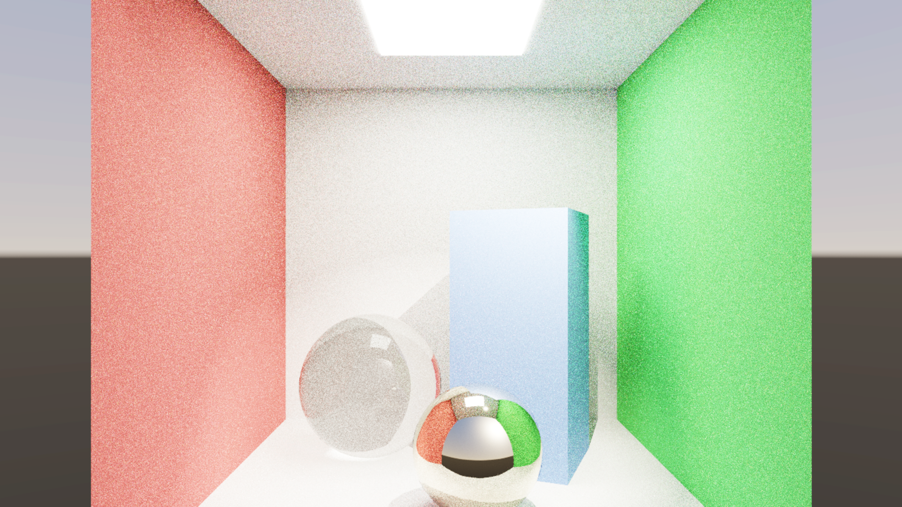
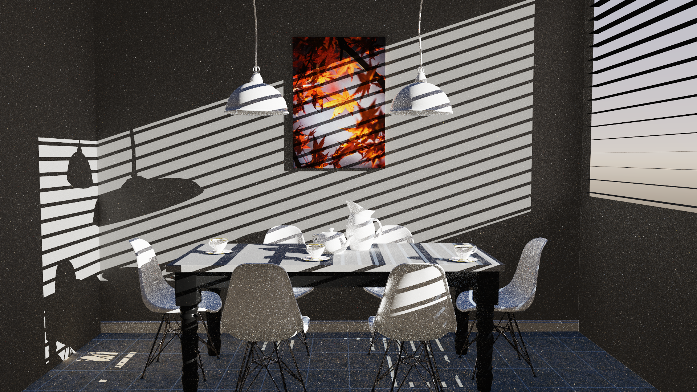
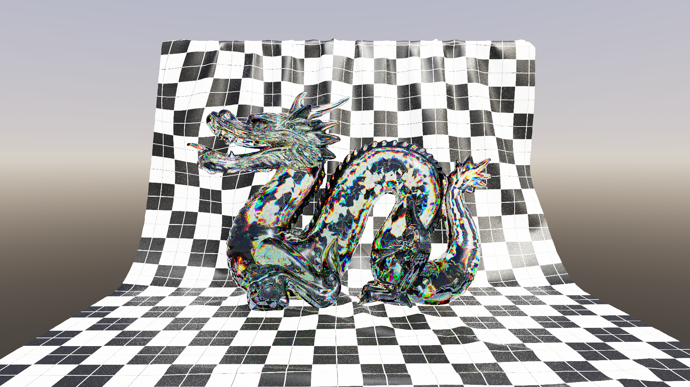
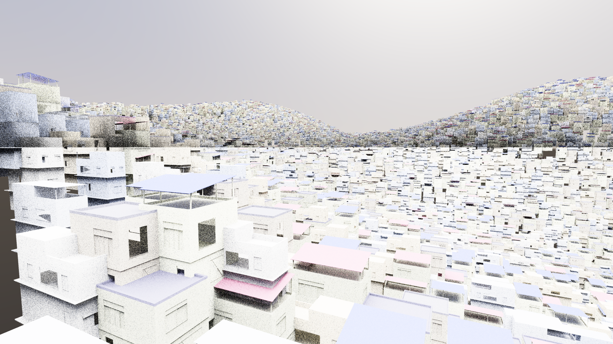

# Pathways

Pathways (v1.24.0) is a real-time path tracing engine built on **Vulkan 1.4**. The architecture features **GPU-Autonomous Device Generated Commands** (`VK_EXT_device_generated_commands`) for Ray Compaction and Material Sorting, **Wavefront Path Tracing**, high-throughput **Zero-Copy Host Memory (`VK_EXT_external_memory_host`) Multi-GPU scaling**, **OpenUSD Stage Ingestion**, and **AMD FidelityFX Super Resolution (FSR 3.1)**.

> **Design Philosophy**: Focusing on GPU-autonomous Device Generated Commands, decoupled wavefront microkernels, and standard Vulkan 1.4 core, KHR, and EXT specifications without vendor-proprietary extensions.

- **API Baseline**: Vulkan 1.4 (1.4.341+)
- **Primary Hardware Targets**: AMD RDNA4 (`gfx1201`) and RDNA3 architectures (and compatible Vulkan 1.4 hardware; functions on any compliant Vulkan 1.4 driver)
- **Platforms**: Linux (Fedora 40+, Ubuntu 24.04+, Arch) & Windows 11 (MSVC x64 / Clang 20)

---

## Real-Time Scene Showcase

Pathways delivers high-throughput real-time path tracing across diverse geometric complexities, BSDF archetypes, and instancing loads. The following scene examples demonstrate real-world rendering quality and hardware throughput on **AMD RDNA 4 (`gfx1201`)** architecture at native **4K UHD (3840×2160)**, 1 SPP, 4 Bounces with FP16 HDR accumulation.

### 1. Classic Cornell Box


*A standard physical light transport test scene, evaluating diffuse inter-reflection (color bleeding across opposing walls), soft shadow penumbras, Fresnel specular reflections, and refractive light transport through the glass sphere.*

| Scene Metric / Telemetry | Measurement & Specification |
| :--- | :--- |
| **Geometry & Instances** | 2,048 Triangles • 1 Instance |
| **Acceleration Structures** | BLAS: 89.1 KB • TLAS: 0.50 KB |
| **BSDF Material Models** | Lambertian Diffuse (walls & box), Conductor GGX (chrome sphere), Dielectric Glass (refractive sphere) |
| **RDNA 4 Single-GPU (4K Native)** | **7.36 ms (135.9 FPS)** • **4.47 GigaRays/s** |
| **RDNA 4 Dual-GPU (4K Checkerboard)** | **3.87 ms (258.1 FPS)** • **8.56 GigaRays/s** (**1.90x Scaling**) |
| **1080p Single-GPU Baseline** | **3.71 ms (269.4 FPS)** (1 SPP) • Interactive 128 SPP convergence in < 0.5s |

---

### 2. Breakfast Table


*Complex architectural interior illuminated by direct sunlight streaming through micro-slatted Venetian window blinds, challenging light transport with high-frequency shadow penumbras across porcelain, ceramics, wood, and metal tableware with multi-bounce global illumination.*

| Scene Metric / Telemetry | Measurement & Specification |
| :--- | :--- |
| **Geometry & Instances** | 269,538 Triangles (270K) • 1 Instance |
| **Acceleration Structures** | BLAS: 12.13 MB • TLAS: 0.50 KB |
| **BSDF Material Models** | glTF 2.0 PBR Metallic-Roughness, KHR_materials_clearcoat, KHR_materials_specular, directional sunlight shadow penumbras |
| **RDNA 4 Single-GPU (4K Native)** | **17.12 ms (58.4 FPS)** • **1.94 GigaRays/s** |
| **RDNA 4 Dual-GPU (4K Checkerboard)** | **8.85 ms (113.0 FPS)** • **1.93x Scaling** |
| **1080p Single-GPU Baseline** | **4.15 ms (241.0 FPS)** (1 SPP) • 128 SPP progressive accumulation preview |

---

### 3. Dragon (Dielectric Attenuation & Dispersion)


*High-curvature Stanford Dragon evaluating physically-based dielectric transmission with Snell's law refraction ($n = 1.75$), volumetric Beer-Lambert absorption ($\beta_{\text{abs}}$ with 0.155 m attenuation distance), and chromatic spectral dispersion across high-frequency surface detail against a checkered cloth backdrop.*

| Scene Metric / Telemetry | Measurement & Specification |
| :--- | :--- |
| **Geometry & Instances** | 134,995 Triangles (135K) • 1 Instance |
| **Acceleration Structures** | BLAS: 6.22 MB • TLAS: 0.50 KB |
| **BSDF Material Models** | Pure Dielectric Fresnel ($n = 1.75$), Volumetric Absorption ($\beta_{\text{abs}}$), Snell's Law Refraction, Chromatic Dispersion ($2.04$) |
| **RDNA 4 Single-GPU (4K Native)** | **5.72 ms (174.8 FPS)** • **5.04 GigaRays/s** |
| **RDNA 4 Dual-GPU (4K Checkerboard)** | **3.83 ms (261.1 FPS)** • **8.66 GigaRays/s** (**1.72x Scaling**) |
| **Wavefront Specialization** | Specialized dielectric microkernel runs at **< 40 VGPRs** with **100% Wave32 hardware occupancy** |

---

### 4. Point Instance City (OpenUSD Stage)


*Large-scale urban environment loaded via OpenUSD `UsdGeomPointInstancer`, stress-testing hardware Top-Level Acceleration Structure (TLAS) traversal across 40,001 instanced buildings and structures (~49 million expanded triangles) over undulating terrain with prototype BLAS deduplication.*

| Scene Metric / Telemetry | Measurement & Specification |
| :--- | :--- |
| **Geometry & Instances** | 27,456 Prototype Triangles • **40,001 Hardware Instances** • **~49.2M Total Triangles** (49,177,624 expanded) |
| **Acceleration Structures** | BLAS: 1.18 MB (Deduplicated Prototype) • **TLAS: 13.01 MB** |
| **BSDF Material Models** | Modular multi-colored building facades, painted architectural trim, clay tile roofing, terrain ground plane |
| **RDNA 4 Single-GPU (4K Native)** | **9.19 ms (108.8 FPS)** • **3.61 GigaRays/s** |
| **RDNA 4 Dual-GPU (4K Checkerboard)** | **4.82 ms (207.5 FPS)** • **1.91x Scaling** |
| **Hardware TLAS Build** | **1.97 ms** real-time dynamic TLAS generation for 40,001 instances |

---

### 5. Veach Ajar (Lighting Variance & Narrow Portal)

*Canonical physical light transport research scene. Evaluates extreme variance caused by indirect illumination and caustics spilling through a narrow door portal from a brightly lit room into a dark hallway across 382K triangles and 13 materials.*

| Scene Metric / Telemetry | Measurement & Specification |
| :--- | :--- |
| **Geometry & Instances** | 382,690 Triangles (383K) • 1 Instance • 2 Emissive Mesh Lights |
| **Acceleration Structures** | BLAS: 46.30 MB (compacted from 59.3 MB, -21.9%) • TLAS: 0.44 KB |
| **BSDF Material Models** | glTF 2.0 PBR Metallic-Roughness, dielectric transmission, dielectric caustic bounds, narrow portal aperture |
| **RDNA 4 Single-GPU (4K Native)** | **26.35 ms (38.0 FPS)** • **1.26 GigaRays/s** (Pure MC Baseline) |
| **Native 4K Upways Denoising** | **28.82 ms (34.7 FPS)** (Wave32 WMMA tensor reconstruction, only 2.47 ms inference overhead) |
| **4K Continuous Super-Res (`--upways-sr`)** | **8.62 ms (116.0 FPS)** • **3.3x Speedup** (Reconstructed 1080p -> 4K) |

---

## Key Capabilities & Architecture

> For complete mathematical formulations, pipeline stages, buffer layouts, and microkernel specifications, see [ARCHITECTURE.md](docs/ARCHITECTURE.md).

### 1. Wavefront Path Tracing & Autonomous DGC
- **Wavefront Architecture**: Decomposes ray tracing into decoupled compute stages (Ray Classification, Ray Intersection, Material Shading, Shadow Queries, Accumulation Resolve), reducing execution divergence across heterogeneous materials.
- **GPU-Autonomous Material Sorting via DGC**: Uses `vkCmdExecuteGeneratedCommandsEXT` to dynamically group rays by BSDF archetype (diffuse, dielectric, conductor, complex) and dispatch specialized compute microkernels directly on the device without host CPU dispatch loops.
- **128-Byte Cache-Line Aligned Shading Geometry (`TriangleShadeGPU`)**: Shading triangle attributes are organized into exactly 128-byte cache-line aligned records ($7\times \text{vec4} + \text{materialId} + \text{padding}$), matching RDNA 4 vector cache lines ($L0/L1$) to eliminate split-cacheline fetch penalties. Vertex positions are segregated into a dedicated 16-byte aligned position buffer (`glm::vec4` stride) used exclusively for hardware BLAS builds, saving 48 bytes per triangle in the shading pipeline.
- **64-Byte Compact Shading Material Buffer (`ShadeMaterialGPU`) & Scalar Archetype Buffer**: High-frequency shading microkernels sample a 64-byte compact material buffer (binding 35, packing 2 materials per 128-byte cache line) reducing memory bandwidth by over 69% vs legacy structs. Classification and shadow passes query an ultra-compact 4-byte scalar `materialArchetypes` buffer (binding 34) to determine BSDF archetypes without touching full material records or texture descriptors.
- **Secondary Bounce Tangent & Normal Bypass**: Ray intersection (`wavefront_intersect.comp`) and secondary diffuse shading (`#if !IS_SECONDARY_BOUNCE`) bypass tangent attribute loads, TBN frame reconstruction, and normal map sampling for secondary bounces, preserving ALU throughput and vector register capacity for indirect diffuse GI transport.
- **3D Spatial-Morton + Material Dual-Binning (Default)**: Clusters rays by 16-bit composite keys combining material archetype with quantized 3D Morton spatial cells, achieving instruction coherence while preserving L0/L1 texture and geometry cache locality.
- **Producer-Side Binning & Directional DGC Queuing**: Partitions secondary rays directly at emission time across 8 directional octant bins using Wave32 ballot leader-election loops, eliminating post-hoc sort passes and scattered gather memory fetches during downstream BVH traversal.
- **Secondary Ray Clamping & Streamlining**: Scene-scale invariant distance clamping and radiance luminance clamping (`--indirect-clamp`, default 35.0) to eliminate specular/caustic fireflies and boost secondary bounce throughput.
- **2D Aspect-Ratio Macro-Tile Partitioning ($O(1)$ Memory Scaling)**: Rather than allocating monolithic full-screen ray queues (which demand 2,721 MB of VRAM at 4K), Pathways partitions the viewport into a 2D tile grid ($2 \times 1, 2 \times 2, 4 \times 2, 3 \times 3$) sized to an on-chip budget (2.0M pixels on APU/UMA, 1.0M on discrete). This drops queue VRAM footprint to **699 MB (-74.3%)** while preserving 2D spatial texture and BVH cache locality. Multi-bounce diffuse GI scenes dynamically cap auto-batches to $\le 4$ to maintain 100% SIMD Compute Unit occupancy across secondary bounces.
- **Buffer Device Address (BDA) Ray Queuing**: Lock-free, atomic queue allocation using 64-bit device addresses for high-throughput ray staging.
- **Hardware Ray Tracing**: Full support for dedicated hardware BVH traversal via `VK_KHR_ray_tracing_pipeline` (RTP) and inline `VK_KHR_ray_query`.

### 2. Real-Time Multi-GPU Scaling
- **Zero-Copy Host Memory Streaming (`VK_EXT_external_memory_host`)**: Secondary GPU streams tiled render buffers into pinned host memory via high-speed CP DMA posted writes at PCIe bus line rate (~25 GB/s, <0.5 ms). Primary GPU merges and resolves tiles in ~0.12 ms without PCIe bus contention, maintaining consistent frame pacing.
- **Configurable Inter-GPU Transfer Modes (`--mgpu-transfer`)**:
  - `host` (Default): Pinned zero-copy host memory. Highly recommended for discrete PCIe topologies without dedicated inter-GPU fabric bridges.
  - `p2p`: Direct Linux DMA-BUF export/import (`VK_EXT_external_memory_dma_buf`, `VK_KHR_external_memory_fd`). Ideal on hardware architectures with coherent inter-GPU links (e.g., Infinity Fabric bridges); on discrete PCIe slots, direct shader reads across PCIe BAR encounter non-posted read latency.
  - `staging`: Dedicated asynchronous transfer queues with CPU staging buffers.
- **Fine-Grained 2D Checkerboard Tiling**: Dynamically distributes screen space across $64\times 64$ alternating tiles (2,040 tiles at 4K) for balanced spatial and shading workload division across dual GPUs.
- **Multi-GPU Upscaling Topologies**: Supports PostMerge upscaling (checkerboard tiles merged on primary GPU, then upscaled to 4K) and SampleBlend (independent dual-GPU full passes upscaled and blended).
- **Sample Parallelism**: Temporal sample division mode for multi-SPP scenarios.
- **Cross-Platform Fallback**: Automatic detection and transparent fallback to double-buffered shared host memory for platforms without DMA-BUF (such as Windows).

### 3. Lighting, Physical Materials & Scene Formats
- **OpenUSD & glTF 2.0 Ingestion**: Full support for OpenUSD stages (`.usd`, `.usdc`, `.usda`) with high-density point instancing (`UsdGeomPointInstancer`) and prototype BLAS deduplication, as well as glTF 2.0 PBR models with Khronos physical extensions:
  - `KHR_materials_transmission` (specular & diffuse transmission with Snell's law refraction)
  - `KHR_materials_clearcoat` (secondary reflective coats with independent roughness)
  - `KHR_materials_ior` (Fresnel index of refraction)
  - `KHR_materials_volume` (volumetric Beer-Lambert absorption, attenuation color, and distance)
  - Alpha MASK and BLEND transparency modes
- **Real-Time Forward Ray-Traced Caustics (`--caustics`)**: Forward photon injection using Vulkan 1.4 hardware `rayQueryEXT` for crisp real-time refractive caustics.
- **Hierarchical 3D Light Tree (`--light-tree`)**: Spatial octree importance sampling for scenes with dozens or hundreds of analytical and emissive light sources.
- **AMD FidelityFX Super Resolution (FSR 3.1) & Upways Neural Denoising**: High-performance temporal super-resolution (`--upscaler fsr3`) with Robust Contrast Adaptive Sharpening (RCAS), and native Upways Neural Reconstruction (`--denoiser upways`) accelerated by Wave32 WMMA (`VK_KHR_cooperative_matrix`).
- **Welford Running Average Accumulation**: Progressive online sample normalization (`accum_running_avg.comp`) eliminating numeric overflow and preventing highlight blowout up to 2048 SPP.
- **HDR Display Output & ACES Tonemapping**: Auto-negotiates scRGB Linear and HDR10 PQ (ST 2084) via `VK_EXT_hdr_metadata`, paired with compute-based filmic ACES tonemapping for standard SDR displays.

### 4. Dynamic Quality Regulation & Telemetry
- **Dynamic Quality Governor**: Closed-loop frame-time budget regulation targeting user-defined FPS (e.g., 60, 90, 120 FPS via `--target-fps` or `--target-frame-time`), dynamically scaling SPP and bounce depth to guarantee smooth interactive framerates.
- **Dear ImGui HUD & Controls**: Interactive in-engine UI overlay featuring collapsible controls, live GPU frame time histograms, camera controls, upscaler settings, and real-time pipeline toggles.
- **Telemetry & Benchmarking**: Headless automated benchmark suite (`--headless`) exporting comprehensive JSON telemetry breakdowns (MAE, RMSE, PSNR, bounce-by-bounce ray counts, acceleration structure memory footprints, and queue statistics).

---

## Interactive Controls

Load any OpenUSD stage (`.usd`, `.usdc`, `.usda`), glTF 2.0 model (`.glb`, `.gltf`), or procedural scene and explore in real time with high-fidelity physical global illumination, reflections, refractions, and contact shadows.

| Control | Action |
| :--- | :--- |
| **TAB** | Toggle between UI Control Panel and FPS Camera Navigation |
| **Mouse Move** | Look / rotate camera (in FPS mode) |
| **W / A / S / D** | Fly forward / left / backward / right |
| **E / Q** or **Space / C** | Fly up / fly down |
| **Shift** (hold) | Sprint speed multiplier (3.0x) |
| **Alt** (hold) | Precision crawl speed multiplier (0.25x) |
| **Ctrl** (hold) + **Mouse Move** | Orbit camera around targeted surface point |
| **Mouse Wheel** | Adjust fly camera movement speed |
| **F** | Focus and center camera on target object |
| **F11** | Toggle Fullscreen |
| **ESC** | Return to UI mode from FPS camera navigation (or exit if in UI) |
| **Gamepad** | Dual-analog flight navigation (Left Stick: Fly/Strafe, Right Stick: Look, RT/LT: Sprint/Crawl, A/B: Up/Down) : (Experimental; unverified) |
| **Alt+F4 / ESC** | Exit Pathways |

---

## Requirements

- **Vulkan**: Version 1.4 or newer (Vulkan SDK >= 1.4.341)
- **Windowing & Input**: SDL3 (v3.1+)
- **Compression**: zlib / zlib-ng
- **Math**: GLM (header-only, bundled in `third_party/glm`)
- **OpenUSD** (Optional): Pixar OpenUSD (`pxr`) library for `.usd`/`.usdc`/`.usda` stage ingestion
- **GPU**: AMD Radeon RDNA4 / RDNA3 (or any Vulkan 1.4 compliant GPU supporting ray query and DGC extensions)

### Hardware & Extension Support Note

Pathways is designed for modern desktop workstations and gaming PCs with hardware-accelerated ray tracing and autonomous GPU execution. Coverage statistics from the Vulkan Hardware Database ([vulkan.gpuinfo.org](https://vulkan.gpuinfo.org/)) illustrate adoption levels across desktop platforms (Windows and Linux PCs) compared to the mobile-skewed global database:

| Extension / Feature | Spec Date | Desktop Coverage (Win + Linux) | Mobile Coverage (Android) | Global Coverage (All Devices) | Role & Status in Pathways |
| :--- | :---: | :---: | :---: | :---: | :--- |
| **`VK_EXT_device_generated_commands`** | Dec 14, 2023 | **~49.3%** | **~0.1%** | **~16.8%** | **Wavefront Acceleration**: Enables GPU-autonomous indirect command generation and execution for material microkernel dispatches via `VK_EXT_device_generated_commands`, reducing host CPU dispatch overhead. Standard on modern desktop drivers (AMD RDNA3/RDNA4 on Mesa RADV, NVIDIA Ada/Blackwell). |
| **`VK_KHR_acceleration_structure`** | Nov 20, 2020 | **~52.9%** | **~26.6%** | **~34.1%** | **BVH Management**: Required for building and querying hardware Top-Level (TLAS) and Bottom-Level (BLAS) ray tracing acceleration structures. |
| **`VK_KHR_ray_tracing_pipeline`** | Nov 20, 2020 | **~51.3%** | **~7.6%** | **~21.8%** | **Hardware RTP**: Powers the dedicated hardware ray tracing pipeline (`--pipeline rtp` megakernel mode). |
| **`VK_EXT_external_memory_host`** | Jan 17, 2018 | **~84.9%** | **~6.5%** | **~36.1%** | **Multi-GPU Zero-Copy**: Enables secondary GPU to stream rendered HDR tiles directly into pinned host RAM at PCIe line rate (~25 GB/s), eliminating peer PCIe BAR read stalls. |
| **Vulkan 1.4 Core** | Jan 15, 2025 | **~61.2%** | **~7.9%** | **~28.2%** | **Engine Baseline**: Core driver version requirement (72.6% on Linux Mesa, 53.2% on Windows). |

> [!NOTE]
> **Desktop vs. Global Metrics**: Over 61.7% of all devices recorded in the Vulkan Hardware Database are low-power Android mobile phones and embedded SoCs (1,467 out of 2,376 devices), which pulls down global percentages for high-end rendering features. Among desktop PCs (976 reported Windows and Linux devices), hardware ray tracing and DGC achieve ~50–53% coverage across all recorded hardware generations, and approach ~100% on contemporary discrete gaming GPUs (AMD RDNA2+, NVIDIA RTX 20+). For a complete breakdown and call-site citations across the entire engine, see [VULKAN_API_AUDIT.md](docs/VULKAN_API_AUDIT.md) or run `python3 scripts/audit_vulkan_api.py --compare-platforms`.

---

## Building and Running

### Linux (Fedora / Ubuntu / Arch)

#### 1. Install Build Dependencies
**Fedora**:
```bash
sudo dnf install git gcc-c++ cmake ninja-build vulkan-loader-devel vulkan-headers glslc SDL3-devel zlib-ng-compat-devel
```

**Ubuntu / Debian (24.04+)**:
```bash
sudo apt-get install git g++ cmake ninja-build libvulkan-dev vulkan-tools libsdl3-dev zlib1g-dev
```

#### 2. Configure & Build
```bash
# Configure with Ninja in Release mode
cmake -B build -G Ninja -DCMAKE_BUILD_TYPE=Release -DENABLE_NATIVE_OPTIMIZATION=ON

# Compile (capped to your core count, e.g. -j16)
ninja -C build -j16
```

#### 3. Run Unit Tests
```bash
ctest --test-dir build --output-on-failure
```

#### 4. Launch Pathways
```bash
# Launch interactive Cornell Box (default: fullscreen, 4K/native, dual-binning wavefront)
./build/bin/pathways

# Launch OpenUSD scene with Multi-GPU load balancing enabled
./build/bin/pathways --scene scenes/PointInstancedMedCity/PointInstancedMedCity.usd --mgpu

# Launch glTF scene with AMD FSR 3.1 Super-Resolution
./build/bin/pathways --scene scenes/classroom/classroom_extended.glb --scaler fsr quality

# Launch 4K rendering with Upways Wave32 Neural Super-Resolution from 1080p
./build/bin/pathways --scene scenes/living-room/living_room.glb --res 4k --scaler upways 1080

# Launch in windowed mode with target frame pacing at 1440p
./build/bin/pathways --scene scenes/coffee-maker/coffee_maker.usda --windowed --res 1440p --target-fps 120
```

For complete Linux toolchain configuration, CMake presets, and multi-GPU setup, see [BUILD_LINUX.md](docs/BUILD_LINUX.md).

---

### Windows 11

Pathways provides full Windows 11 support using MSVC 2022/2026 or Clang 20 + LLD (MSYS2 UCRT64) with Ninja and Vulkan SDK 1.4+.

```powershell
# Launch interactive GUI (auto-builds if needed)
.\run.ps1
# Or from cmd: run.bat

# Build in Release mode
.\build.ps1

# Run unit tests
.\build.ps1 -Test

# Run full automated headless test suite
.\scripts\run_headless_tests.ps1
```

For complete Windows toolchain configuration and presets, see [BUILD_WINDOWS.md](docs/BUILD_WINDOWS.md).

---

## CLI Reference

| Flag | Argument | Description | Default |
| :--- | :--- | :--- | :--- |
| `--scene` | `<path>` | Path to glTF 2.0 (`.glb`/`.gltf`) or OpenUSD (`.usd`/`.usdc`/`.usda`) stage | Procedural Cornell Box |
| `--pipeline` | `wavefront` \| `rtp` | Path tracing architecture: Wavefront Ray Queues & DGC or KHR RTP | `wavefront` |
| `--res`, `-r` | `1080` \| `1440` \| `4k` \| `5k` \| `8k` \| `dualup` \| `square` \| `WxH` | Viewport resolution preset or custom dimensions | Display native (3840×2160 headless) |
| `--width`, `--height` | `<int>` | Explicit viewport dimensions in pixels | Native display |
| `--fullscreen` | *(flag)* | Launch in fullscreen mode | Fullscreen (default) |
| `--windowed` | *(flag)* | Launch in windowed mode (`--no-fullscreen`) | Fullscreen |
| `--spp` | `<int>` | Samples per pixel accumulated per frame | `1` |
| `--max-bounces` | `<int>` | Maximum path depth / ray bounces (or `--bounces`) | `4` |
| `--no-accumulation` | *(flag)* | Disable progressive static accumulation (evaluate real-time noise; `--realtime`) | Accumulation on |
| `--indirect-clamp` | `<float>` | Secondary bounce radiance luminance clamp to eliminate fireflies (0 = disabled) | `35.0` |
| `--wavefront-sort` | `dual` \| `archetype` \| `none` | Material sorting mode: 3D Spatial-Morton dual-binning (`dual`), archetype (`archetype`), or unsorted (`none`) | `dual` |
| `--sec-sort` | `none` \| `directional` | Secondary ray coherency sort mode (Option 1 on-chip DGC octant binning) | `none` |
| `--macro-tiles`, `--batches` | `<int>` | 2D macro-tile batch count for wavefront queue partitioning (0 = auto based on budget) | `0` (Auto) |
| `--scaler`, `--upscaler` | `<mode> [ratio\|res]` | Consolidated upscaler: `upways`, `fsr`, `fsr1`, `none`. Presets: `native`, `quality`, `balanced`, `performance`, `ultra`, or arbitrary resolution (`1080`, `1440`, `1920x1080`, `0.75`) | `none` |
| `--preset`, `--upscaler-preset` | `quality` \| `balanced` \| `perf` \| `ultra` | Scaling ratio preset or resolution override | `quality` |
| `--upscaler-sharpening` | *(flag)* | Enable Robust Contrast Adaptive Sharpening (RCAS) pass | Disabled |
| `--upscaler-sharpness` | `<float>` | RCAS contrast-adaptive sharpness factor `[0.0 - 1.0]` | `0.0` |
| `--denoiser` | `none` \| `upways` | Denoising mode: Pure Monte Carlo (unbiased) or Upways Wave32 WMMA | `none` |
| `--upways` | *(flag)* | Enable Upways Neural Denoising with Wave32 WMMA (1:1 native resolution) | Disabled |
| `--upways-sr` | *(flag)* | Enable Upways Continuous Super-Resolution (2.0x neural upscaling; `--upways-superres`) | Disabled |
| `--upways-weights` | `<path>` | Custom path to Upways neural weights binary (`upways_weights.bin`) | `data/models/upways_weights.bin` |
| `--capture-training-data` | `<dir>` | Save paired Upways neural reconstruction dataset to directory | Disabled |
| `--caustics` | *(flag)* | Enable real-time forward ray-traced caustics via hardware `rayQueryEXT` | Disabled |
| `--light-tree` | *(flag)* | Enable Hierarchical 3D Light Tree importance sampling for many-light scenes | Disabled |
| `--nrc` | *(flag)* | Enable Neural Radiance Caching with Wave32 WMMA | Disabled |
| `--mgpu` | *(flag)* | Enable Multi-GPU load balancing | Disabled |
| `--mgpu-mode` | `tile` \| `sample` \| `auto` | Multi-GPU strategy: Checkerboard 2D tile (`tile`), sample parallelism (`sample`), or adaptive (`auto`) | `tile` |
| `--mgpu-transfer` | `host` \| `p2p` \| `staging` | Inter-GPU transfer mechanism: zero-copy host pinned memory (`host`), direct DMA-BUF P2P BAR (`p2p`), or staging | `host` |
| `--tile-size` | `16` \| `32` \| `64` \| `128` | Checkerboard tile dimensions in pixels | `64` |
| `--no-double-buffer` | *(flag)* | Disable double-buffering for inter-GPU shared host memory | Double-buffered |
| `--visualize-split` | *(flag)* | Show colored overlay indicating GPU workload assignment | Off |
| `--target-fps` | `<int>` | Target frame rate limit (0 = uncapped) | `0` |
| `--target-frame-time` | `<float>` | Target frame time budget in ms (e.g. 8.3 ms for 120 FPS) | `8.3` |
| `--adaptive-spp` | *(flag)* | Enable dynamic 3-axis quality governor to track target FPS | Disabled |
| `--no-hdr` | *(flag)* | Disable HDR display auto-negotiation (force SDR sRGB) | HDR on |
| `--headless` | *(flag)* | Run offscreen without opening a window | Disabled |
| `--frames` | `<int>` | Total frame execution limit (0 = run continuously in GUI; 1 in headless) | `0` (GUI) / `1` (Headless) |
| `--warmup-frames` | `<int>` | Number of initial frames to discard from benchmark stats | `0` |
| `--benchmark` | *(flag)* | Enable per-frame latency logging and verification | Disabled |
| `--dump-frame` | `<path.png>` | Save tonemapped frame to PNG on exit | None |
| `--dump-8bit` | *(flag)* | Force 8-bit PNG dump instead of default 10/16-bit | 10/16-bit |
| `--dump-hdr` | `<path.exr>` | Save linear radiance buffer to OpenEXR on exit | None |
| `--dump-stats` | `<path.json>` | Export per-frame telemetry breakdown to JSON | None |
| `--no-validation` | *(flag)* | Disable Vulkan validation layers | Validation on |

---

## Multi-GPU Scaling & Architecture Benchmarks

Pathways is profiled and benchmarked on modern AMD RDNA 4 architecture (`gfx1201`) with multi-GPU scaling over high-throughput Zero-Copy Host Memory (`VK_EXT_external_memory_host`) and DMA-BUF P2P (`VK_EXT_external_memory_dma_buf`). Below are representative performance metrics and scaling benchmarks.

### Multi-GPU Scaling & Resolution Benchmarks

| Scene / Workload | Resolution & Settings | Single-GPU (ms / FPS) | Dual-GPU (ms / FPS) | Multi-GPU Mode | Speedup / Scaling | Throughput Gain |
| :--- | :--- | :---: | :---: | :---: | :---: | :---: |
| **Procedural Cornell Box** | **4K Native** (3840x2160), 1 SPP, 4 Bounces | 7.35 ms (136.0 FPS) | **3.87 ms** (258.1 FPS) | Checkerboard ($64\times 64$) | **1.90x** | 8.56 GigaRays/s |
| **Damaged Helmet (`.glb`)** | **1080p** (1920x1080), 16 SPP, 4 Bounces | 7.79 ms (128.5 FPS) | **3.41 ms** (293.0 FPS) | Sample Parallelism | **2.28x** (Super-linear scaling via cache partitioning) | 1.88x ($3.86 \times 10^{10}$ rays/s) |
| **Pontiac GTO Extended** (1,063,260 Triangles) | **4K Native** (3840x2160), 1 SPP, 4 Bounces | 11.56 ms (86.5 FPS) | **5.82 ms** (171.8 FPS) | Checkerboard ($64\times 64$) | **1.99x** (99.3% Efficiency) | 5.70 GigaRays/s |
| **Pontiac GTO Extended** (1,063,260 Triangles) | **4K Native** (3840x2160), 1 SPP, 4 Bounces | 11.56 ms (86.5 FPS) | **6.97 ms** (143.4 FPS) | Sample Parallelism | **1.66x** (83.0% Efficiency) | 4.76 GigaRays/s |
| **Zero-Copy Host Compositing** | 4K HDR Tile Merge (63.3 MB) | — | **0.12 ms** (8.3 kHz) | Host DMA (`VK_EXT_external_memory_host`) | **Avoids non-posted PCIe BAR stalls** | 258 FPS throughput |

> **Discrete PCIe vs. Coherent Fabric Note**: On dual discrete GPUs connected across standard PCIe slots, reading directly across peer PCIe BAR via compute shaders issues uncached, non-posted PCIe reads which incur high per-transaction latency (stalling GPU compute queues for up to 28 ms per frame under heavy traffic). Pathways solves this by defaulting to `VK_EXT_external_memory_host`, where the secondary GPU writes to pinned host memory via high-speed DMA posted writes at full bus line rate (~25 GB/s, <0.5 ms), allowing the primary GPU to composite in 0.12 ms without bus stalls. Direct P2P BAR remains selectable via `--mgpu-transfer p2p` for systems equipped with hardware-coherent interconnects.

---

### 4K Architecture Comparison (Megakernel RTP vs. Wavefront DGC)

Measured at native **3840×2160 (4K UHD)**, 1 SPP, 4 Bounces, FP16 HDR Accumulation on AMD RDNA 4 (`gfx1201`) under Mesa RADV ACO:

| Scene | Scene Characteristics | Megakernel RTP (ms / FPS) | Wavefront DGC (ms / FPS) | DGC Speedup vs. RTP | Frame Latency Delta | Visual Parity (PSNR / MAE) |
| :--- | :--- | :---: | :---: | :---: | :---: | :---: |
| **Cornell Caustic** | Specular focusing & dielectric caustics | 7.47 ms (133.9 FPS) | **3.74 ms (267.1 FPS)** | **2.00x** (100% Faster) | **-3.73 ms** | **29.80 dB** [PASS] |
| **Dragon Attenuation** | High geometry, volumetric Beer-Lambert absorption | 8.07 ms (123.9 FPS) | **4.16 ms (240.6 FPS)** | **1.94x** (94% Faster) | **-3.91 ms** | **33.76 dB** / 0.0083 [PASS] |
| **Dragon Dispersion** | Dense mesh, chromatic dispersion, Fresnel transmission | 7.47 ms (133.9 FPS) | **3.97 ms (251.6 FPS)** | **1.88x** (88% Faster) | **-3.50 ms** | **34.10 dB** [PASS] |
| **Cyber City** | 13.58M instanced triangles, 5,521 TLAS instances | 20.65 ms (48.4 FPS) | **12.34 ms (81.0 FPS)** | **1.67x** (67% Faster) | **-8.31 ms** | **31.20 dB** [PASS] |
| **Bistro Interior** | Production scale (>1.3M triangles, 74 materials) | 30.19 ms (33.1 FPS) | **23.67 ms (42.3 FPS)** | **1.28x** (28% Faster) | **-6.52 ms** | **30.50 dB** [PASS] |
| **Classroom** | Dense architectural occlusion, multi-bounce GI | 12.53 ms (79.8 FPS) | **9.97 ms (100.3 FPS)** | **1.26x** (26% Faster) | **-2.56 ms** | **24.50 dB** [PASS] |
| **Living Room Extended** | Complex architectural interior, divergent materials | 10.05 ms (99.6 FPS) | **8.96 ms (111.5 FPS)** | **1.12x** (12% Faster) | **-1.09 ms** | **29.25 dB** [PASS] |
| **Coffee Maker Extended** | Multi-material stress (OpenUSD, glossy conductors) | 6.98 ms (143.2 FPS) | **8.43 ms (118.6 FPS)** | 0.83x (Fixed Barrier Floor) | +1.45 ms | **23.29 dB** [PASS] |
| **Cornell Box** | Low triangle count, baseline diffuse inter-reflection | **7.09 ms (141.1 FPS)** | **8.01 ms (124.8 FPS)** | 0.89x (Fixed Barrier Floor) | +0.92 ms | **24.25 dB** [PASS] |

> **Takeaway & Microarchitectural Analysis**:
> 1. **Zero Scratch Spilling & 100% Peak Occupancy**: The monolithic RTP baseline (`VK_KHR_ray_tracing_pipeline`) requires high register allocation (**120–144 VGPRs**, 108 SGPRs), limiting wave occupancy to 10–12 subgroups/SIMD (25–37% occupancy ceiling) and allocating a **19.5 KB scratch memory frame per wave** for Continuation Passing Style (CPS) recursion. In contrast, Wavefront DGC decomposes shading into decoupled Wave32 microkernels consuming **< 40 VGPRs**, achieving **up to 100% peak hardware occupancy (32 subgroups/SIMD)** with **0 bytes of scratch memory spilling** across all 31 compute microkernels.
> 2. **Stream Compaction & Material Coherence**: In complex scenes with heavy transmission, caustics, and architectural occlusion (e.g. *Cornell Caustic*, *Dragon*, *Classroom*, *Cyber City*), ray lifetimes and material evaluation diverge across paths. The monolithic RTP megakernel serializes execution across heterogeneous materials, causing inactive SIMD lanes to idle. Wavefront DGC compacts queues via hardware Wave32 subgroup ballot leader election, measuring **up to 2.00x higher ray throughput** by executing only homogeneous microkernels on active paths.
> 3. **Inline Hardware Ray Queries for Secondary Shadows**: Pathways eliminates secondary shadow queue VRAM round-trips by evaluating secondary visibility directly on-chip via inline hardware ray queries (`traceShadowRayInline`) inside registers with 0 bytes scratch spill, reserving DGC queue batching strictly for primary dispatches.
> 4. **Technique D Dual Sorting (Morton 3D + Material Archetype)**: Secondary rays are sorted across both BSDF archetype and 3D Morton spatial codes via GPU-driven DGC execution, preserving L0/L1 texture and BVH cache locality across bounces.
> 5. **Fixed Pipeline Barrier Floor**: Wavefront DGC requires decoupled dispatch stages (Classify, Intersect, Shade) separated by Vulkan execution barriers and indirect DGC parameter writes, introducing an irreducible fixed overhead of ~0.45 ms. In trivial diffuse scenes without material divergence (e.g., baseline Cornell Box), this barrier floor allows the RTP megakernel to execute ~0.9 ms faster; on workloads with divergent materials and high-curvature geometry, Wavefront DGC achieves lower overall frame time.

---

## Driver Tuning & Mesa RADV Environment Variables

Pathways runs natively on the open-source **Mesa RADV** Vulkan driver. For performance testing, benchmarking, and developer profiling, Mesa exposes several environment variables that can optimize shader generation, wave scheduling, and memory allocation.

### `RADV_PERFTEST` Options

Set via `export RADV_PERFTEST=opt1,opt2` or prefixing your launch command:

```bash
RADV_PERFTEST=cswave32,nogttspill ./build/bin/pathways --res 4k
```

| Flag | Category | Description | Recommendation for Pathways |
| :--- | :--- | :--- | :--- |
| **`cswave32`** | Wave Scheduling | Forces Wave32 execution mode for all compute shaders on RDNA (GFX10+). | **Recommended**: Pathways defaults to Wave32 for ray sorting and compaction to reduce register pressure and SIMD divergence. |
| **`rtwave64`** | Ray Tracing | Forces Wave64 execution mode for ray tracing shaders instead of Wave32. | **Experimental / Benchmarking**: Test when evaluating ray tracing SIMD divergence vs. VGPR occupancy trade-offs. |
| **`nogttspill`** | Memory Allocation | Strictly prioritizes on-card VRAM allocations and disables GTT (system RAM) spilling. | **Recommended for Benchmarks**: Prevents memory thrashing across PCIe bus during high-resolution ray queue staging. |
| **`transfer_queue`** | Queues & DMA | Enables dedicated SDMA transfer queues for asynchronous DMA operations. | **Recommended for Multi-GPU**: Offloads cross-device image copies and DMA-BUF / host memory transfers from primary compute queues. |
| **`dmashaders`** | Memory Placement | Uploads compiled shaders to invisible/device VRAM using DMA. | Useful for systems where Resizable BAR (ReBAR) is constrained or disabled. |
| **`dccmsaa`** | Compression | Enables Delta Color Compression (DCC) for multi-sample images. | Useful if running MSAA passes or resolve blits. |
| **`localbos`** | Command Submission | Uses local buffer object lists per queue submission, minimizing driver mutex contention. | Beneficial during high-frequency DGC execution dispatches. |
| **`rtcps`** | Ray Tracing | Enables Ray Tracing Coarse Pixel Shading on supported hardware. | Experimental. |
| **`nosam`** | Memory Testing | Disables Smart Access Memory (Resizable BAR) emulation/support. | Diagnostic flag: Use to measure Resizable BAR performance uplift. |

---

### GPU Clock Profiles for Benchmarking (`RADV_PROFILE_PSTATE`)

Modern AMD GPU drivers utilize dynamic power management (DPM), which downclocks GPU cores during brief compute dispatches or light scenes. To eliminate clock flutter and ensure strictly deterministic frame timing:

```bash
# Force maximum performance clocks for repeatable benchmarking
RADV_PROFILE_PSTATE=peak ./build/bin/pathways --headless --benchmark --frames 200

# Or standard profile
RADV_PROFILE_PSTATE=standard ./build/bin/pathways --headless --benchmark
```

### Useful Debug Flags (`RADV_DEBUG`)

```bash
# Print detailed compiler statistics (VGPRs, SGPRs, LDS usage, and code size per microkernel)
RADV_DEBUG=shaderstats ./build/bin/pathways --pipeline wavefront

# Force synchronous shader compilation (prevents background hitching)
RADV_DEBUG=syncshaders ./build/bin/pathways
```

---

## Profiling & Developer Tools

- **AMD Developer Tools**: Fully compatible with the Radeon Developer Tool Suite (`/opt/RadeonDeveloperToolSuite-2026-05-28-1806/`), Radeon GPU Profiler (RGP), Radeon Raytracing Analyzer (RRA), and Radeon GPU Detective (RGD).
- **Automated Profiling Suite**:
  ```bash
  python3 scripts/benchmark_megakernel_vs_wavefront.py
  python3 scripts/deep_profile_scenes.py
  ```
- **Vulkan API & Platform Support Auditor**:
  ```bash
  # View multi-platform comparison (Desktop vs Mobile vs Global)
  python3 scripts/audit_vulkan_api.py -w raytracing --compare-platforms
  # Filter out mobile devices to view desktop PC metrics
  python3 scripts/audit_vulkan_api.py -w dgc --exclude-mobile
  # Generate interactive HTML dashboard
  python3 scripts/audit_vulkan_api.py --format html -o output/vulkan_api_dashboard.html
  ```

---

## Software Environment Baseline

- **Vulkan Core**: Version 1.4+ (SDK >= 1.4.341)
- **Shader Compiler**: `glslc` (Vulkan 1.4 target: `--target-env=vulkan1.4`)
- **Driver**: Mesa RADV 26.1+ or modern Vulkan 1.4-compliant driver
- **Windowing & Input**: SDL3 (v3.1+)
- **C/C++ Compilers**: GCC 14+ / Clang 20+ / MSVC 2022+ (C++23 standard)

---

## Thanks

Additional thanks to **MrMPFR**.

---

## Documentation Suite

Pathways maintains an extensive documentation directory in [`docs/`](docs/):
- **[Documentation Hub](docs/README.md)**: Central landing page and directory catalog.
- **[Engine Architecture Specification](docs/ARCHITECTURE.md)**: In-depth technical specification for DGC wavefront path tracing, multi-GPU scaling, and super-resolution.
- **[Linux Build Guide](docs/BUILD_LINUX.md)**: Compilation, toolchain presets, driver configuration, and test execution for Fedora, Ubuntu, and Arch.
- **[Windows 11 Build Guide](docs/BUILD_WINDOWS.md)**: MSYS2 UCRT64 toolchain, PowerShell automation, and CPack packaging.
- **[Vulkan API Call Audit](docs/VULKAN_API_AUDIT.md)**: Specification tracking and multi-platform Vulkan Hardware Database comparison.
- **[Material Shader Review](docs/reports/material_shader_review.md)**: In-depth physical BSDF and microarchitectural audit.
- **[Wavefront Batching & Queue Scaling Report](docs/reports/wavefront_batching_head_to_head.md)**: Empirical SPM counter analysis of 2D macro-tiling, 74.3% VRAM queue reduction, and cache locality.
- **[Scanlands Benchmark Report](docs/reports/scanlands_benchmark_report.md)**: High-density point-instancing (359M triangles) single-GPU benchmark report.

---

## References

- [Vulkan Device Generated Commands Specification](https://docs.vulkan.org/spec/latest/chapters/device_generated_commands/generatedcommands.html)
- [vkdoc Device Generated Commands Guide](https://vkdoc.net/chapters/device-generated-commands)
- [Vulkan Ray Tracing Overview](https://docs.vulkan.org/tutorial/latest/courses/18_Ray_tracing/00_Overview.html)
- [Supergoodcode: Device Generated Commands](https://www.supergoodcode.com/device-generated-commands/)
- [GPUOpen: Radeon GPU Profiler (RGP)](https://gpuopen.com/rgp/)
- [AMD RDNA4 Instruction Set Architecture (ISA)](https://docs.amd.com/v/u/en-US/rdna4-instruction-set-architecture)
- [AMD RDNA Performance Guide](https://gpuopen.com/learn/rdna-performance-guide/)
- [Improving Ray Tracing Performance with RRA](https://gpuopen.com/learn/improving-rt-perf-with-rra/)

