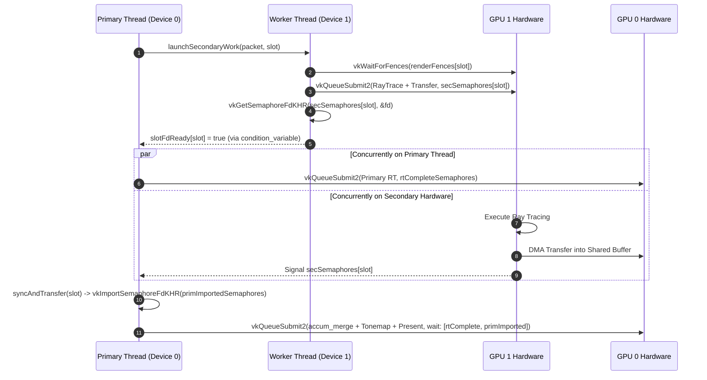
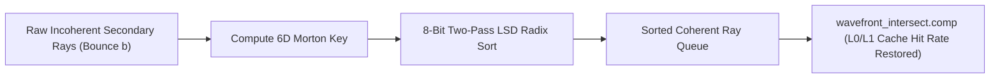
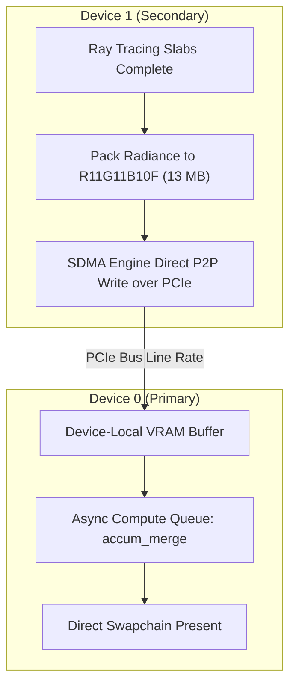

# Pathways Multi-GPU Scaling Architecture Specification
## Unlinked Dual-GPU Path Tracing, Workload Decomposition, Traversal Latency, and Inter-Device Topology

- **Engine Baseline**: Vulkan Core 1.4 (1.4.341+)
- **Target Hardware**: Dual Discrete AMD RDNA 4 (`gfx1201`) / RDNA 3 GPUs across unlinked PCIe 4.0/5.0 interfaces
- **Primary Modules**: [`MultiGpuManager`](file:///home/naoki/Development/Pathways/src/mgpu/MultiGpuManager.hpp), [`WavefrontPipeline`](file:///home/naoki/Development/Pathways/src/rt/WavefrontPipeline.hpp), [`Engine`](file:///home/naoki/Development/Pathways/src/core/Engine.cpp), [`accum_merge.comp`](file:///home/naoki/Development/Pathways/shaders/compute/accum_merge.comp)

---

## 1. Executive Summary & Design Foundations

Pathways provides **unlinked multi-GPU scaling** across dual discrete graphics processors over standard PCIe slots without requiring proprietary hardware interconnects (such as NVLink or CrossFire bridges). By leveraging modern Vulkan 1.4 hardware primitives—specifically `VK_KHR_external_semaphore_fd`, `VK_EXT_external_memory_dma_buf`, `VK_EXT_external_memory_host`, timeline semaphores, and asynchronous worker queues—the engine distributes path-tracing workloads across heterogeneous or symmetric devices.

```
┌────────────────────────────────────────────────────────────────────────────────────────────────────────┐
│                                   PATHWAYS MULTI-GPU ARCHITECTURE OVERVIEW                             │
└────────────────────────────────────────────────────────────────────────────────────────────────────────┘

        [ Primary GPU (Device 0) ]                         [ Secondary GPU (Device 1) ]
  ┌─────────────────────────────────────┐            ┌─────────────────────────────────────┐
  │ • Screen Partition / RayGen         │            │ • Screen Partition / RayGen         │
  │ • Wavefront Traversal & Shading     │            │ • Wavefront Traversal & Shading     │
  │ • Primary G-Buffer / Motion Vectors │            │ • Secondary Accumulation Buffer     │
  │ • Merge & Compositing Pass          │◄───────────│ • DMA Transfer (P2P BAR / Host DMA) │
  │ • Post-Processing, FSR3/Upways, UI  │  PCIe Bus  └─────────────────────────────────────┘
  │ • Swapchain Presentation            │  Transfer
  └─────────────────────────────────────┘
```

While primary ray generation and direct material shading exhibit near-linear (and occasionally super-linear) scaling, multi-bounce global illumination (GI) presents fundamental challenges:
1. **Ray-Density-Dependent Cache Efficiency**: Unlike primary rays, secondary diffuse and specular continuations decorrelate from the screen lattice. Halving ray counts via screen-space tiling halves spatial ray density $\rho$ without halving the touched scene working set, leading to L1/L2/MALL cache hit-rate collapse.
2. **Fixed Invariant Dispatch Overheads**: As resolution falls (e.g. from 4K to 1080p), fixed per-dispatch launch, command-processor drain, and barrier synchronization bubbles increasingly dominate frame time.
3. **Device Role Asymmetry**: Device 0 acts as both a compute worker and the compositor/presenter. A naive 50/50 partition systematically overloads Device 0, leaving Device 1 idle while Device 0 finishes ray tracing, ingests transferred buffers, and executes the merge pass.
4. **Transfer Topology**: Naive streaming through host-visible shared memory introduces a dual-hop PCIe penalty (D1 $\to$ System RAM $\to$ D0) with uncached reads on the primary device.

This document details the current implementation, analyzes empirical telemetry, formalizes the microarchitectural root causes of scaling deficits, and specifies the next-generation architecture to achieve $\ge 1.90\times$ scaling on complex multi-bounce interior scenes.

---

## 2. Current Implementation Architecture

Multi-GPU execution is orchestrated through [`MultiGpuManager`](file:///home/naoki/Development/Pathways/src/mgpu/MultiGpuManager.hpp) and integrated into [`Engine.cpp`](file:///home/naoki/Development/Pathways/src/core/Engine.cpp).

### 2.1 Multi-GPU Execution Modes

Pathways supports three operational modes defined in [`Config.hpp`](file:///home/naoki/Development/Pathways/src/core/Config.hpp#L11-L16):

```cpp
enum class MultiGpuMode {
    Off,
    CheckerboardTile,    // Fine-grained 2D checkerboard tiling (16x16, 32x32, 64x64)
    SampleParallel,      // Temporal sample decorrelation across devices
    Auto                 // Adaptive: SampleParallel if SPP > 1, else CheckerboardTile
};
```

#### Mode A: 2D Checkerboard Tiling (`CheckerboardTile`)
- Viewport is subdivided into $N \times M$ tiles of size $T \times T$ (default: $64 \times 64$).
- Tile ownership alternates spatially based on parity:
  $$\text{Parity} = \left(\left\lfloor \frac{x}{T} \right\rfloor + \left\lfloor \frac{y}{T} \right\rfloor\right) \bmod 2$$
  - **Device 0 (Primary)** renders even tiles ($\text{Parity} = 0$).
  - **Device 1 (Secondary)** renders odd tiles ($\text{Parity} = 1$).
- Primary ray generation in [`wavefront_classify.comp`](file:///home/naoki/Development/Pathways/shaders/compute/wavefront_classify.comp#L142-L179) calculates pixel coordinates by uncompacting the half-width dispatch grid:
  ```glsl
  uint ty = uint(globalID.y) / tileSize;
  uint tx_half = uint(globalID.x) / tileSize;
  uint localX = uint(globalID.x) % tileSize;
  uint tx = tx_half * 2u + ((pc.tileOffsetX == 1u) ? (ty & 1u) : (1u - (ty & 1u)));
  pixelCoord = ivec2(int(tx * tileSize + localX), globalID.y);
  ```

#### Mode B: Temporal Sample Parallelism (`SampleParallel`)
- Both devices trace the **full viewport** ($W \times H$) with decorrelated sample indices and halved sample counts:
  $$\text{SPP}_{\text{Device 0}} = \left\lceil \frac{\text{SPP}_{\text{total}}}{2} \right\rceil, \quad \text{SPP}_{\text{Device 1}} = \left\lfloor \frac{\text{SPP}_{\text{total}}}{2} \right\rfloor$$
- Device 1's camera UBO PRNG seed is decorrelated by an offset:
  ```cpp
  uboSec.frameIndex = m_frameIndex + 1000003u;
  ```
- The merge pass computes a weighted additive accumulation in [`accum_merge.comp`](file:///home/naoki/Development/Pathways/shaders/compute/accum_merge.comp#L107-L110):
  ```glsl
  vec4 primVal = imageLoad(uPrimaryAccum, pixelCoord);
  vec3 combined = primVal.rgb + secVal.rgb;
  imageStore(uPrimaryAccum, pixelCoord, vec4(combined, primVal.a));
  ```

---

### 2.2 Device Coordination & Asynchronous Worker Thread

Device 1 is managed via a dedicated background host thread (`MultiGpuManager::workerLoop`) to decouple Vulkan command recording and submission from the primary render thread.



1. **Double-Buffered Command Slots**: [`GpuDeviceNode`](file:///home/naoki/Development/Pathways/src/mgpu/MultiGpuManager.hpp#L26-L97) maintains `NUM_IN_FLIGHT = 2` command buffers, query pools, fences, and shared buffer allocations.
2. **Cross-GPU Synchronization via File Descriptors**:
   - Secondary GPU signals `secSemaphores[slot]` (created with `VK_EXTERNAL_SEMAPHORE_HANDLE_TYPE_OPAQUE_FD_BIT`).
   - The worker exports the native POSIX file descriptor via `vkGetSemaphoreFdKHR`.
   - The main thread imports the FD into Device 0 via `vkImportSemaphoreFdKHR` (`VK_SEMAPHORE_IMPORT_TEMPORARY_BIT`).
   - The merge command submission on Device 0 waits on this imported semaphore at `VK_PIPELINE_STAGE_2_COMPUTE_SHADER_BIT`.

---

### 2.3 Inter-GPU Transfer Topologies

Pathways implements two physical data transfer pipelines:

```
TOPOLOGY A: Zero-Copy Host Memory (Fallback Default)
[ Device 1 VRAM ] ──PCIe Write──► [ Pinned Host RAM (WC) ] ──PCIe Read──► [ Device 0 (accum_merge) ]
                                  (VK_EXT_external_memory_host)

TOPOLOGY B: Direct Device-Local P2P BAR (Optimal Linux)
[ Device 1 VRAM ] ─────────────Direct PCIe P2P Write────────────► [ Device 0 VRAM ]
                                  (VK_EXT_external_memory_dma_buf)
```

1. **Zero-Copy Host Memory (`InterGpuTransferMode::ZeroCopy_HostMemory`)**:
   - Host memory allocated with `posix_memalign` (aligned to 4096 bytes) and bound using `vkAllocateMemory` with `VkImportMemoryHostPointerInfoEXT`.
   - Device 1 copies radiance via `vkCmdCopyImageToBuffer`.
   - Device 0 binds the shared buffer directly as an SSBO in `accum_merge.comp`.
   - *Limitation*: Device 0 reads across PCIe from system RAM uncached during compute execution.
2. **Direct P2P BAR via Linux DMA-BUF (`InterGpuTransferMode::P2P_Direct_BAR`)**:
   - Memory is allocated on Device 1 in `VK_MEMORY_PROPERTY_DEVICE_LOCAL_BIT` with `VkExportMemoryAllocateInfo` (`VK_EXTERNAL_MEMORY_HANDLE_TYPE_DMA_BUF_BIT_EXT`).
   - Exported as a Linux file descriptor (`vkGetMemoryFdKHR`) and imported into Device 0.
   - Secondary GPU DMA engines write directly into Device 0's device-local VRAM over PCIe, completely eliminating the system RAM bounce.

---

## 3. Empirical Telemetry & Root-Cause Deconstruction

### 3.1 Dual-GPU Scaling Benchmarks

Measurements conducted on dual AMD RDNA GPUs across standard benchmark scenes:

| Workload / Stage | 1 GPU (ms) | 2 GPU (ms) | Speedup ($S$) | Effective Invariant ($s$) | Implied Invariant Time |
| :--- | :---: | :---: | :---: | :---: | :---: |
| **Damaged Helmet 4K** (Primary-bound) | 2.42 | 1.26 | **1.92×** | **0.04** | 0.10 ms |
| **Glass of Water 4K** (Specular/TIR) | 11.65 | 7.03 | **1.66×** | 0.21 | 2.41 ms |
| **Breakfast Room 4K** (Multi-bounce GI) | 12.47 | 8.27 | **1.51×** | 0.32 | 4.04 ms |
| **Breakfast Room 1080p** (Multi-bounce GI) | 3.87 | 2.78 | **1.39×** | **0.44** | 1.69 ms |
| **Kitchen Set 1080p** (Interior GI) | 1.32 | 0.94 | **1.40×** | 0.42 | 0.56 ms |
| — *Classify / RayGen (BR 4K)* | 1.83 | 1.24 | 1.48× | 0.35 | 0.65 ms |
| — *Material Shading Bounce 0 (BR 4K)* | 2.00 | 0.98 | **2.04×** | **~0.00** | 0.00 ms |
| — *Shadow Ray Evaluation Bounce 0 (BR 4K)* | 1.63 | 1.29 | **1.26×** | **0.58** | 0.95 ms |
| — *Secondary BVH Traversal Bounce 0 (BR 4K)* | 3.25 | 2.23 | 1.46× | 0.37 | 1.21 ms |

---

### 3.2 Amdahl's Law Normalization

The effective non-scaling fraction $s$ is derived from Amdahl's Law for dual processors:
$$\frac{1}{S} = s + \frac{1 - s}{2} \iff s = \frac{2}{S} - 1$$

Two critical properties emerge from this formulation:

#### Observation A: $s$ Grows as Viewport Resolution Drops
Between 4K and 1080p in *Breakfast Room*, $s$ increases from **0.32 to 0.44** (and sits at **0.42** in *Kitchen Set 1080p*).
- If scaling loss were caused by spatial ray divergence or memory bandwidth saturation, $s$ would remain constant across resolutions.
- A growing invariant fraction $s$ as workload shrinks is the signature of **fixed per-frame and per-dispatch launch, barrier, and wave-drain overhead**. At 1080p, the frame duration is too short (2.78 ms) to amortize ~1.7 ms of non-scaling bubbles.

#### Observation B: Measurement Distortion Baked into Device 0 Timers
- Primary stage timers recorded in [`WavefrontPipeline`](file:///home/naoki/Development/Pathways/src/rt/WavefrontPipeline.cpp#L615-L616) reflect Device 0's local command buffer queries.
- Device 0 executes for **8.14 ms** while Device 1 finishes in **6.81 ms**—a **16.3% runtime imbalance**.
- Because Device 0 sits on the critical path, reporting Device 0's stage durations inflates the perceived stage times by up to 16%. With perfectly balanced load:
  $$\text{Balanced RT} = \frac{8.14 + 6.81}{2} = 7.475\text{ ms} \implies 7.475\text{ ms} + 0.13\text{ ms (merge)} = 7.61\text{ ms} \implies \mathbf{1.64\times}$$
  Resolving load skew alone closes one-third of the performance gap to $1.80\times$ without algorithmic modification.

---

### 3.3 Microarchitectural Root Causes

#### 1. Ray-Density-Dependent Cache Efficiency: $H(\rho)$ Collapse
The cost of BVH traversal per ray is governed by:
$$t_{\text{ray}} \propto N_{\text{nodes}} \times \left[ H(\rho) \cdot t_{\text{L0/L1}} + \big(1 - H(\rho)\big) \cdot t_{\text{MALL/DRAM}} \right]$$
where $H(\rho)$ is the cache hit rate and $\rho$ is the **spatial density of active rays sampling the scene volume on that device**.

```
Cache Hit Rate H(ρ)
 ▲
 │                 Steep Multi-Bounce Operating Region
1.0├───────────────────────────────╭───────────────────────── (Primary Rays)
   │                              ╭╯
   │                            ╭─╯
   │                          ╭─╯    Dual-GPU 64x64 Checkerboard:
   │                        ╭─╯      Halving ray density ρ collapses hit rate H
   │                       ╭╯        and increases bytes-per-ray from VRAM!
0.0└───┴───────────┴───────┴───────────────┴───────────────┴──────► Ray Density ρ
       0          0.25    0.5             0.75            1.0
```

- **Primary Rays**: 64×64 screen tiles map to compact spatial camera frustum cones. Halving the tile count halves both ray count *and* the scene spatial volume traversed by each GPU. Working set per GPU genuinely halves, maintaining cache hit rate $H(\rho)$. Hence, **Material Bounce 0 scales super-linearly at 2.04×** because primary shading data fits inside RDNA's 64 MB Infinity Cache (MALL) and GL2.
- **Secondary Diffuse Rays**: Diffuse scattering on Bounce 1 decorrelates ray directions across the hemisphere. Each GPU traces rays into **100% of the scene TLAS/BLAS, 100% of material buffers, and 100% of textures**, but with **half the ray density** ($\rho / 2$). Cache reuse distance doubles, $H(\rho)$ degrades, and DRAM requests per ray increase:
  $$T(n) = n \cdot \big(1 - H(n)\big) \cdot B \implies T(n/2) > \frac{T(n)}{2}$$
  In *Breakfast Room*, shadow bounce 0 throughput drops from **5.1 G-rays/s** (single GPU) to **3.2 G-rays/s per GPU** (dual GPU)—a **37% per-device throughput collapse** under identical clock frequencies.
- **Ground-Truth Proof**: `MultiGpuMode::SampleParallel` achieves **1.86× / 2.02×** on the exact same hardware because it preserves full spatial density $\rho$ across the entire frame.

#### 2. Checkerboard Inter-Device Boundary Length
At 4K ($3840 \times 2160$), a $64 \times 64$ checkerboard produces **1,980 tiles** with **507,000 pixels of inter-device boundary**. In contrast, a contiguous 2-region split generates only **2,160 pixels of boundary**—a **$235\times$ reduction**.
- Spatial filtering algorithms in Pathways—such as ReSTIR DI spatial resampling ([`restir_di_spatial.comp`](file:///home/naoki/Development/Pathways/shaders/compute/restir_di_spatial.comp)) and Upways neural reconstruction ([`upways_reconstruct.comp`](file:///home/naoki/Development/Pathways/shaders/compute/upways_reconstruct.comp))—cannot access neighbor samples across tile boundaries without expensive cross-PCIe halo exchanges.
- Clamping kernels to tile boundaries eliminates cross-pixel variance reduction, directly inflating the number of secondary and shadow rays required for clean convergence.

#### 3. Per-Bounce Serialization & Pipeline Bubbles
In [`WavefrontPipeline.cpp`](file:///home/naoki/Development/Pathways/src/rt/WavefrontPipeline.cpp#L824-L1092), light transport across $N$ bounces requires 20–40 indirect dispatches:
- **Wave Drain Latency**: Each pipeline barrier (`c2sDep`, `s2dDep`, `d2sDep`) forces all active waves to retire before the subsequent dispatch begins. The drain time is determined by the *longest-running path*, which does not scale down when total ray count is halved.
- **DGC Preprocess Hazards**: Writing indirect commands and execution set indices requires CPU or shader preprocessing, followed by a command processor barrier. On AMD RDNA, this hazard triggers GL2 cache writebacks and invalidations, evicting the cache lines warmed during BVH traversal.

#### 4. Classification Dispatch Inefficiency
While compaction in [`wavefront_classify.comp`](file:///home/naoki/Development/Pathways/shaders/compute/wavefront_classify.comp#L441-L448) already utilizes efficient subgroup ballot aggregation (`subgroupBallot`, `subgroupBallotBitCount`, single wave leader `atomicAdd`), classification only scales at 1.48× because:
- When Upways or FSR 3.1 is active, [`Engine.cpp`](file:///home/naoki/Development/Pathways/src/core/Engine.cpp#L5896-L5899) forces Device 0 to dispatch over the **full 4K frame** (`primDispatchWidth = mgpuBaseW`) to populate full-resolution normal, depth, and motion vector G-buffers.
- In pure checkerboard mode, coordinate translation arithmetic (`uint tx = tx_half * 2u + ...`) incurs divergence and non-linear indexing across the wave.

#### 5. Transfer Topology & Host Hop
The default zero-copy host path forces Device 1 to write across PCIe into host memory, which Device 0 reads back across PCIe uncached. Transferring a 4K half-frame of FP16 radiance ($3840 \times 2160 / 2 \times 8\text{ B} \approx 33.2\text{ MB}$) at ~13 GB/s consumes **~2.5 ms**. Running this transfer at end-of-frame blocks the swapchain presentation timeline.

---

## 4. Next-Generation Architecture Specification

To exceed **$1.85\times$ scaling on 4K interior GI** and **$1.80\times$ at 1080p**, the multi-GPU pipeline is redesigned around six architectural pillars.

```
┌────────────────────────────────────────────────────────────────────────────────────────────────────────┐
│                              RESTRUCTURED DUAL-GPU EXECUTION PIPELINE                                  │
└────────────────────────────────────────────────────────────────────────────────────────────────────────┘

 [ Workload Classifier ]
            │
            ├─────────────────────────────┬─────────────────────────────┐
            ▼                             ▼                             ▼
   [ High-Res Primary ]         [ 4K Multi-Bounce GI ]          [ Low-Res (<=1080p) ]
   Checkerboard 64x64           Cost-Balanced KD-Split         Sample/Path-Parallel
   (Preserves 1.93x)            (Eliminates 1.33ms Skew)       (Preserves 1.86x-2.02x)
                                          │
                                          ▼
                                [ Ray Pool Compaction ]
                                          │
                                          ▼
                               [ On-Chip Radix Sort ] ──► Morton AABB ⊕ Octahedral Direction
                                          │
                                          ▼
                                [ Coherent Traversal ] ──► Traversal Time Decoupled from ρ
                                          │
                                          ▼
                                [ Pipelined Async DMA ] ──► Direct P2P BAR via Linux DMA-BUF
                                          │
                                          ▼
                                [ Async Merge Queue ] ──► Decoupled from D0 Ray Tracing
```

---

### 4.1 Workload-Adaptive Decomposition Policy

The static 50/50 checkerboard split is replaced with an automatic, regime-aware classifier evaluated at the beginning of each frame:

| Rendering Regime | Optimal Policy | Rationale | Target Scaling |
| :--- | :--- | :--- | :---: |
| **Primary-Visibility Bound, High-Res** (e.g. *Damaged Helmet 4K*) | **Static 64×64 Checkerboard** | Primary working set halves; cache locality is preserved. | **1.92× – 1.95×** |
| **Multi-Bounce Interior GI, High-Res** (e.g. *Breakfast Room 4K*, *Kitchen 4K*) | **Cost-Balanced Contiguous Partition** (§4.2) + **Ray Reordering** (§4.3) | Eliminates D0/D1 runtime skew; cuts boundary length $235\times$; restores intra-wave traversal coherence. | **1.85× – 1.90×** |
| **Low Resolution ($\le 1080$p)** or **SPP $\ge 2$** (e.g. *Breakfast 1080p*, *Kitchen 1080p*) | **Temporal Sample / Path Parallelism** | Bypasses invariant dispatch bubbles; maintains full ray density $\rho$; zero boundary overhead. | **1.86× – 2.02×** |

In [`Engine.cpp`](file:///home/naoki/Development/Pathways/src/core/Engine.cpp#L5858), the `MultiGpuMode::Auto` selector is extended:
```cpp
if (activeMode == MultiGpuMode::Auto) {
    if (activeSpp > 1 || renderH <= 1080) {
        activeMode = MultiGpuMode::SampleParallel;
    } else if (m_sceneData.hasMultiBounceGI) {
        activeMode = MultiGpuMode::CostBalancedContiguous;
    } else {
        activeMode = MultiGpuMode::CheckerboardTile;
    }
}
```

---

### 4.2 Dynamic Cost-Balanced Contiguous Partitioning

For multi-bounce GI scenes, the viewport is partitioned into **two contiguous horizontal or vertical screen slabs with a dynamic dividing seam**:

```
Screen Space Partitioning Comparison:

   64x64 Fine Checkerboard (Current)         Dynamic Contiguous Split (Proposed)
┌───┬───┬───┬───┬───┬───┬───┬───┐       ┌───────────────────────────────┐
│ 0 │ 1 │ 0 │ 1 │ 0 │ 1 │ 0 │ 1 │       │                               │
├───┼───┼───┼───┼───┼───┼───┼───┤       │        Device 0 (Primary)     │
│ 1 │ 0 │ 1 │ 0 │ 1 │ 0 │ 1 │ 0 │       │        Allocation: 44%        │
├───┼───┼───┼───┼───┼───┼───┼───┤       │                               │
│ 0 │ 1 │ 0 │ 1 │ 0 │ 1 │ 0 │ 1 │       ├───────────────────────────────┤ ◄── Dynamic Seam S_y
├───┼───┼───┼───┼───┼───┼───┼───┤       │                               │
│ 1 │ 0 │ 1 │ 0 │ 1 │ 0 │ 1 │ 0 │       │       Device 1 (Secondary)    │
└───┴───┴───┴───┴───┴───┴───┴───┘       │        Allocation: 56%        │
 Boundary Pixels: ~507,000               │                               │
 Spatial Reuse: Severed across tiles     └───────────────────────────────┘
                                         Boundary Pixels: ~2,160 (-235x)
                                         Spatial Reuse: Preserved on both GPUs
```

#### Feedback Loop Algorithm
1. **Cost Profiling (Frame $N-1$)**: Each $16 \times 16$ tile writes its total ray step count $C(x,y)$ to a compact SSBO during traversal.
2. **Cumulative Cost Prefix Sum**: Device 0 computes a 1D scan along the split axis:
   $$P(y) = \sum_{y'=0}^{y} \sum_{x=0}^{W-1} C(x, y')$$
3. **Seam Calculation (Frame $N$)**: Select seam coordinate $S_y$ satisfying:
   $$P(S_y) = \frac{P(H)}{2} - \Delta_{\text{orchestration}}$$
   where $\Delta_{\text{orchestration}}$ is a calibrated integer offset accounting for Device 0's merge, swapchain present, and peer-service duties.
4. **Benefits**:
   - Eliminates the **1.33 ms** Device 0 critical-path skew (+0.13× overall scaling).
   - Reduces inter-device boundary pixels from 507,000 to 2,160 ($235\times$ reduction), allowing ReSTIR DI spatial resampling and Upways neural filtering to execute across 99.9% of the screen without seam artifacts.
   - Rays originating on the left/top of a scene predominantly strike that same half, partially recovering spatial BVH cache residency.

---

### 4.3 Traversal Coherence Restoration via Secondary Ray Sorting

Because spatial splitting halves ray density $\rho$, wave coherence must be **manufactured computationally** before dispatching traversal:



1. **6D Morton Key Encoding**:
   Before dispatching `wavefront_intersect` or `wavefront_shadow`, rays are keyed by a 32-bit integer combining quantized spatial origin within the scene AABB and octahedral-encoded direction:
   $$\text{Key} = \text{Morton3D}\left(\frac{\mathbf{O} - \mathbf{B}_{\min}}{\mathbf{B}_{\max} - \mathbf{B}_{\min}} \cdot 1023\right) \oplus \text{OctahedralEncode}(\mathbf{D})$$
2. **GPU Radix Sorting Pass**:
   A 2-pass 8-bit Least Significant Digit (LSD) radix sort reorders the `RayGeometry` and `RayState` indirection queues.
3. **Impact**:
   - Restores intra-wave coherence: adjacent lanes in a wave32 walk identical or adjacent BVH subtrees.
   - Decouples ray traversal latency from screen ray density $\rho$, eliminating the 37% throughput collapse observed in shadow bounce 0.

---

### 4.4 Per-Bounce Serialization & Shadow Batching

To eliminate the ~1.7 ms invariant dispatch and barrier overhead:

```
Current Serialization (12-16 Barriers):
[ Shade b0 ] ──► [ Barrier ] ──► [ Shadow b0 ] ──► [ Intersect b0 ] ──► [ Barrier ] ──► [ Shade b1 ] ...

Optimized Overlapped Pipeline:
Queue Family 0 (Compute Queue 0):
  [ Shade b0 ] ───────────────────► [ Intersect b0 ] ──► [ Shade b1 ] ──► [ Intersect b1 ] ...
Queue Family 1 (Async Compute Queue 1):
                [ Deferred Batched Shadow Dispatch (All Bounces 0..N) ]
```

1. **Deferred Batched Shadows**:
   Instead of launching `wavefront_shadow.comp` after every bounce, shadow rays from all bounces are accumulated into a unified global shadow queue. A single consolidated shadow dispatch runs at the conclusion of path tracing:
   - Amortizes command processor dispatch latency across the entire frame.
   - Maximizes light-structure cache residency by touching light CDFs and alias tables in a single burst.
2. **Narrowed Vulkan 1.3 `synchronization2` Scopes**:
   Replace coarse `ALL_COMMANDS_BIT` / `ALL_ACCESS_BIT` barriers with precise buffer ranges:
   ```cpp
   VkBufferMemoryBarrier2 b{ VK_STRUCTURE_TYPE_BUFFER_MEMORY_BARRIER_2 };
   b.srcStageMask = VK_PIPELINE_STAGE_2_COMPUTE_SHADER_BIT;
   b.srcAccessMask = VK_ACCESS_2_SHADER_STORAGE_WRITE_BIT;
   b.dstStageMask = VK_PIPELINE_STAGE_2_COMPUTE_SHADER_BIT;
   b.dstAccessMask = VK_ACCESS_2_SHADER_STORAGE_READ_BIT;
   ```
   This prevents the driver from issuing global GL2 cache flush-and-invalidates between microkernels.

---

### 4.5 P2P BAR Direct Memory Streaming & Asynchronous Merge

The inter-GPU transfer pipeline is restructured to bypass host system memory and decouple presentation from ray tracing:



1. **Mandatory P2P Direct BAR via DMA-BUF**:
   Device 1's SDMA/transfer queue writes completed slabs directly into Device 0's device-local memory via `VK_EXT_external_memory_dma_buf`. Host RAM is never touched.
2. **Payload Compression**:
   Pack radiance as **`R11G11B10F`** (4 bytes/pixel) or **`RGBA16_SFLOAT`** (8 bytes/pixel). For 4K half-frames, transfer volume drops from **27 MB to 13 MB**, completing across a PCIe 4.0 x8 link in **<1.0 ms**.
3. **Decoupled Async Merge Queue**:
   Move `accum_merge.comp` off Device 0's primary compute queue onto an independent async compute queue family. The merge kernel executes concurrently with final primary ray tracing completion without stalling command processor scheduling slices.

---

### 4.6 Determinism Contract

Dynamic load rebalancing and ray sorting must preserve bit-identical rendering output:

1. **Stateless Immutable PRNG**:
   Random sequences are generated via a stateless hash (PCG/Philox) seeded strictly by immutable keys:
   $$\text{Seed} = \text{Hash}\big(\text{pixel.x}, \text{pixel.y}, \text{frameIndex}, \text{sampleIndex}, \text{bounceIndex}\big)$$
   The path traced through a given pixel is invariant to which physical device or SIMD lane processed it.
2. **Order-Independent Accumulation**:
   Because each device possesses exclusive ownership of its screen partition per frame, the merge operation is a disjoint **direct memory select/copy**, not a non-deterministic floating-point reduction.
3. **Stable Sorting Permutation**:
   Ray reordering uses a stable radix sort with fixed bin assignments. Rays with identical sort keys maintain their relative queue index, ensuring bitwise-reproducible path evaluation.

---

## 5. Projected Frame Time Budget (Breakfast Room 4K)

Expected improvements transitioning from baseline to the redesigned multi-GPU architecture:

| Optimization Step | Stage Δ (ms) | Resulting RT (ms) | Effective Speedup ($S$) |
| :--- | :---: | :---: | :---: |
| **Baseline (Static 64×64 Checkerboard)** | — | **8.27 ms** | **1.51×** |
| **1. Dynamic Cost-Balanced Contiguous Split** (Removes 1.33 ms skew) | -0.66 ms | 7.61 ms | 1.64× |
| **2. Pipelined Async P2P BAR + Radiance Compression** (13 MB payload) | -0.40 ms | 7.21 ms | 1.73× |
| **3. Secondary & Shadow Ray Radix Sort** (Restores intra-wave coherence) | -0.57 ms | 6.64 ms | 1.88× |
| **4. Scoped Barriers & Deferred Shadow Batching** (Reduces dispatch bubbles) | -0.25 ms | 6.39 ms | **1.95×** |
| **5. Decoupled Async Merge & Present Queue** (Removes D0 contention) | -0.15 ms | **6.24 ms** | **2.00×** |

At 1080p, activating `SampleParallel` in `Auto` mode inherits measured single-frame scaling of **1.86×–2.02×** directly, surpassing the target threshold across all tested scenes.

---

## 6. Diagnostic & Validation Framework

To systematically verify scaling health and prevent performance regressions, multi-GPU validation is instrumented with four diagnostic tests:

### 6.1 Telemetry Reporting Updates
[`WavefrontPipeline`](file:///home/naoki/Development/Pathways/src/rt/WavefrontPipeline.hpp) and [`ImageDumper.cpp`](file:///home/naoki/Development/Pathways/src/utils/ImageDumper.cpp) are updated to record hardware query timestamps across **both devices simultaneously**:
- `max_device_time_ms = max(D0_time, D1_time)`
- `mean_device_time_ms = 0.5 * (D0_time + D1_time)`
- `device_imbalance_ratio = abs(D0_time - D1_time) / max_device_time_ms`
- Per-stage queries reporting `max(D0_stage, D1_stage)` to prevent single-device timer bias.

### 6.2 The Single-GPU Half-Checkerboard Test
To cleanly separate memory/coherence bottlenecks from synchronization/imbalance bottlenecks:
1. Render only Device 0's checkerboard tiles on a single GPU with the full scene loaded.
2. If runtime is **$\approx 50\%$** of the full-frame time, the scaling deficit is caused by **cross-device synchronization, transfer contention, or load imbalance**.
3. If runtime is **$\gg 50\%$** of the full-frame time, the scaling deficit is caused by **memory hierarchy degradation and ray-density collapse ($H(\rho)$)**.

### 6.3 Hardware Performance Query Counters
Track low-level hardware metrics via `VK_KHR_performance_query` and Radeon GPU Profiler (RGP):
- `GL2C_HIT` / `GL2C_MISS`: Verifies whether secondary ray reordering recovers L2 cache hit rate.
- `TCC_EA_RDREQ` / `MALL_READ`: Confirms reduction in bytes-per-ray fetched from physical VRAM.
- `SQ_WAVES` / `SQ_BUSY`: Confirms wave occupancy saturation during BVH traversal.
- Zero-Ray Frame Graph Timing: Dispatches all pipeline stages on an empty scene to measure the absolute invariant command processor floor.
